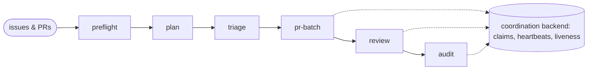
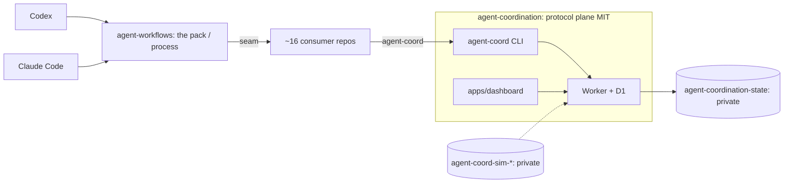
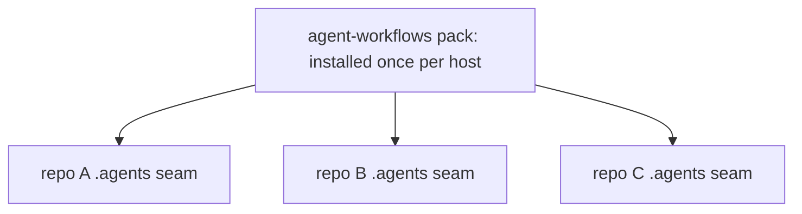

# Landing page design — ShakaCode Agent Workflow Playbook

Date: 2026-07-08
Status: proposed (awaiting review before an implementation plan)

## Goal

Ship a public landing page that drives adoption of this open-source pack and
establishes ShakaCode's credibility in running AI coding agents at scale. The
page leads with the working pack plus the codified methodology — the two things
that are real today — and lets consulting interest follow as a soft secondary
outcome rather than the headline.

- Primary audience: engineering teams already running Codex or Claude Code who
  want a repeatable, trust-gated process for multi-PR agent work.
- Primary CTA: get started — star the repo and install the pack.
- Secondary CTA: read the methodology (long-form).
- Tertiary, low-key: work with ShakaCode.

## Decisions locked (this session)

| Decision | Choice |
| --- | --- |
| Positioning | Open-source pack + codified methodology (not product-vision, not lead-gen) |
| URL | `agent-workflows.shakacode.com` (subdomain; no new domain) |
| Scope | One landing page plus one long-form methodology article; deep docs stay in the repo |
| Visual identity | Match shakacode.com's existing brand |
| Wordmark | Text wordmark ("Agent Workflow Playbook") for v1; graphical mark later |

## Non-goals (v1)

- Not a hosted docs site. The canonical docs stay under [`docs/`](README.md); the
  landing page links into them. A rendered docs site can be added later if
  adoption warrants it.
- Not the coordination product vision. The multi-operator dashboard ("two
  developers on the same PR"), the Cloudflare Worker backend, and the future
  ShakaStack product plane are the *ecosystem* the page points at, not its hero.
  They are still maturing (dashboard issue #9 is unstarted), so leading with them
  would over-claim.
- No lead-gen funnel, gated content, or email capture beyond a GitHub link and a
  single soft "work with us" link.

## Information architecture

One page, top to bottom:

1. **Hero** — headline + subhead + dual CTA. Headline candidates:
   - "Run AI coding agents in fleets — safely."
   - "A portable playbook for running Codex and Claude Code across all your repos."
   Subhead: plan → batch → review → audit, with a repo seam you install once.
   Primary CTA `Get started`; secondary `Read the methodology`. Visual: the
   batch-lifecycle diagram (below) or an asciinema cast of a real `pr-batch`.
2. **The problem** — one-agent-one-PR does not scale; running many agents across
   many repos is chaos without process (trust, CI parity, review, scope creep,
   merge safety).
3. **How it works** — the batch lifecycle diagram; "install the process once per
   host, each repo exposes a tiny `.agents/` seam."
4. **What you get** — 6–8 headline skills, one-line benefit each: `plan-pr-batch`,
   `triage`, `pr-batch`, `adversarial-pr-review`, `post-merge-audit`,
   `replicate-ci`, `verify` / `verify-pr-fix`, `update-changelog`.
5. **The safety story** (lead differentiator) — the security preflight ("a public
   issue can't prompt-inject your agent"), operator hard-stops, trust-gated
   actors. See [`docs/trust-and-preflight.md`](trust-and-preflight.md) and
   [`docs/security-posture.md`](security-posture.md).
6. **Proof / dogfooding** — real usage: dogfooded on react_on_rails and across
   ShakaCode's repos. Concrete, no over-claim. Exact numbers verified before
   publish.
7. **Methodology teaser** — pull-quotes from the article → link to the full piece.
8. **ShakaCode + soft consulting CTA** — "We help teams adopt this." One low-key
   link.
9. **Footer** — Star on GitHub · Install · Methodology.

## The methodology article (`/methodology`)

A public, polished version of the "how we actually use AI coding agents"
techniques (from the Justin + Robert pairing session). Restructured for readers:
mindset → the core loop → adversarial review → verification habits → parallel
work → anti-patterns. This is the SEO / social magnet and the consulting proof —
it shows how the team works, which is what buyers evaluate. Credit the pairing.

## Diagrams

Authored as in-repo assets (SVG for the site, mermaid here for review). No image
model needed — labels stay exact and restyleable to the brand.

### Batch lifecycle (hero, section 3)

Untrusted issues/PRs pass a security-preflight gate, then flow through five
stages, all backed by the coordination backend. (Rendered as a themed SVG in the
build; the amber gate is the differentiator made visual.)

### System topology (Option 2 end-state)

### The seam model

Install the process once; each repo exposes a small policy seam — no full
`.agents/` tree copied (and drifting) into every checkout.

## Visual / brand direction

- Match shakacode.com: extract its exact color tokens and type scale during the
  build; reuse them so the subdomain feels coherent. (Build prerequisite.)
- Flat, clean, developer-brand aesthetic (Linear / Vercel / Stripe era). No heavy
  gradients or neon.
- Hero art and social/OG imagery: generated with an image model (prompt kept with
  the build assets); exact labeled diagrams: authored as SVG. Text on all
  generated art is added in code, never baked into the image.

## Tech and deploy

- Framework: Astro (zero-JS by default, MDX for the article, room to add Starlight
  docs later).
- Location: a `site/` directory in this repo — content lives with the pack; one
  PR updates code and site. Cloudflare Pages builds from the subdirectory.
- Host: Cloudflare Pages; CNAME `agent-workflows.shakacode.com`. (Same Cloudflare
  account as the coordination Worker.)
- Analytics: Cloudflare Web Analytics (free, privacy-friendly, no cookie banner).
- Content sourcing: README, CONTEXT.md, docs/, the skill inventory, the techniques
  doc — assembly and polish, not net-new authoring.

## Prerequisites and open items

- **License confirmed.** The repo includes an MIT `LICENSE`, consistent with the
  coordination protocol plane (agent-coordination ADR 0002).
- Extract shakacode.com brand tokens (colors, type) — build prerequisite.
- Verify the exact dogfooding numbers before publishing section 6.
- Record an asciinema cast of a real `pr-batch` run for the hero (optional but
  high-impact).
- Decide article canonical location (this page vs cross-post) for SEO.

## Success metrics

- GitHub stars / forks and install activity (primary).
- Methodology article reads and inbound shares (secondary).
- Any inbound "work with us" contacts (tertiary signal, not a target).

## Next step

On approval, turn this into an implementation plan (writing-plans): scaffold
Astro under `site/`, build the four diagrams as themed SVGs, assemble copy from
existing docs, wire Cloudflare Pages + the CNAME, and draft the methodology
article.
