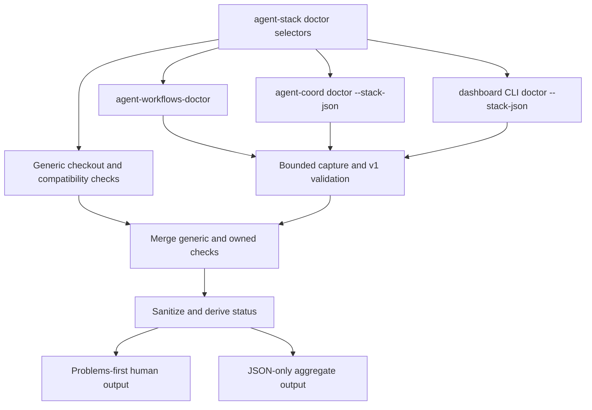

# Component-Owned Agent Stack Doctor - Plan

## Goal Capsule

- **Objective:** Provide one read-only `agent-stack doctor` report while keeping operational diagnostics in the component repositories that own them.
- **Authority:** The master owns generic discovery, bounded delegation, contract validation, sanitization, aggregation, and rendering. It does not recreate component checks.
- **Execution profile:** Coordinated three-repository change with independently releasable component contracts.
- **Stop conditions:** Stop if a component cannot implement the uniform contract without weakening read-only behavior, bounded execution, redaction, or `0/1/2/64` status parity.
- **Tail ownership:** The publishing coordinator integrates the three component changes, verifies compatible versions together, and owns PR/CI closeout.

---

## Product Contract

### Master responsibilities

`agent-stack doctor` is a thin aggregator. It owns only:

1. source checkout and compatibility-link inspection for the three known repositories;
2. read-only backend-selector discovery needed to invoke coordination;
3. bounded component execution with process-group cleanup and output ceilings;
4. uniform-contract validation, status/exit parity, additive-field filtering, and secret sanitization;
5. conservative component/overall aggregation plus problems-first human and JSON rendering.

The master never probes workflow installation, coordination resources, dashboard HTTP endpoints, or package metadata itself. Those checks belong to component doctors.

### Component contract v1

Every component emits all required v1 fields; additive fields may also be
present and are forward-compatible:

```json
{"schema_version":1,"component":"<id>","status":"healthy|degraded|failed","checks":[]}
```

Each check has:

- string `id`;
- `status` in `healthy|degraded|failed|skipped`;
- string `summary`;
- object `details`;
- `guidance` as a string or `null`.

Component status is derived from checks: failed dominates degraded, degraded dominates healthy, and an otherwise skipped-only set is healthy. Delegate exits are `0` healthy, `1` degraded, `2` failed, and `64` usage/unable-to-run. The master rejects component, check, status, and exit mismatches. Unknown additive fields remain forward-compatible but are discarded before aggregation.

When a delegate is missing, times out, exceeds bounds, exits `64`, emits malformed JSON, or violates the contract, the master adds only a generic `<component>.doctor` wrapper check. It never synthesizes the internal IDs that a component would have emitted. The earlier fixed-14-check promise is removed.

### Required component interfaces

1. Workflow component, owned by this repository and installed through `install-agent-workflows`:

   ```text
   <target>/bin/agent-workflows-doctor --stack-json [--deep] --host HOST --target DIR --source DIR
   ```

   It owns installation/status and workflow-seam checks.

2. Coordination component, released by `agent-coordination`:

   ```text
   <agent-coord-install-dir>/agent-coord doctor --stack-json [--deep] --state-root ~/.agent-workflows/state
   ```

   It owns CLI, backend, and resource diagnostics.

3. Dashboard component, released by `agent-coordination-dashboard`:

   ```text
   node <dashboard-source>/bin/agent-coordination-dashboard.js doctor --stack-json [--deep] --url URL
   ```

   It owns package, service, and deep runtime diagnostics. A stopped optional dashboard returns a degraded contract and exit `1`.

### Backend discovery

The master forwards the first applicable selector without creating it:

1. explicit `AGENT_COORD_STATE_ROOT`, even when missing;
2. explicit `AGENT_COORD_API_URL`;
3. explicit `AGENT_COORD_BACKEND`;
4. explicit `AGENT_COORD_STATUS_STATE_ROOT`;
5. existing `${AGENT_STACK_RUNTIME_ROOT:-$HOME/.agent-workflows}/state` or the `--runtime-root` equivalent;
6. existing XDG/default agent-coordination state root.

A missing explicit `AGENT_COORD_STATE_ROOT` is authoritative. The coordination delegate owns the resulting failed contract and must not create the path.

### Safety and output

- The command validates the loopback-only dashboard URL before inspecting or invoking components.
- Delegate stdout is capped at 1 MiB, stderr at 64 KiB, and execution at 10 seconds; timeout cleanup terminates the entire process group.
- Child stderr and raw malformed output never escape the normalized aggregate.
- URL userinfo, sensitive query values, malformed percent-encoded queries, environment secrets, ANSI escapes, and control characters are sanitized before either renderer.
- JSON mode writes only the aggregate document to stdout.
- Human mode starts with the overall verdict and component counts, orders problems before healthy context, and prints the same guidance stored in JSON.
- Overall exit is `0`, `1`, or `2`; invalid options or missing master Ruby/helper prerequisites exit `64`.
- The doctor performs only component-owned, validated, bounded loopback HTTP probes; it does not fetch external resources or mutate state.
- It does not sync, install, start, repair, or create a selected root.

---

## High-Level Design



The outer aggregate contains `schema_version`, `status`, `deep`, `checked_at`, and three `components`. Each component entry preserves the uniform v1 component shape after its two generic checks are prepended.

---

## Implementation Units

### U1. Workflow-owned component doctor

- **Files:** `bin/agent-workflows-doctor`, its focused public-command tests, installer and installer tests.
- **Behavior:** Adapt `agent-workflows-status` and the optional deep seam helper into the uniform contract; bound child execution; return component status parity.
- **Acceptance:** Healthy install exits `0`; upgrade available exits `1`; invalid/missing/mismatched helpers exit `2` with valid JSON; shallow seam is `skipped`; deep seam is executed read-only.

### U2. Focused master aggregator

- **Files:** thin `bin/agent-stack-doctor` and `bin/agent-stack` entrypoints, focused Ruby/shell modules, and sync installation of the complete runtime.
- **Behavior:** Add generic source/link checks, resolve the coordination selector, invoke the exact three interfaces, validate contracts, sanitize, aggregate, and render.
- **Acceptance:** Healthy/degraded/failed parity, additive/malformed child output, unavailable wrappers, runtime-root precedence, missing explicit root forwarding, dangling-link distinction, malformed URL redaction, bounded output, process cleanup, optional stopped dashboard, and non-mutation all pass through the public command.

### U3. Split tests and install surfaces

- **Files:** small test drivers in `bin/`, focused suites under `test/agent_stack` and `test/agent_doctor`, installer tests, and `bin/validate`.
- **Behavior:** Keep sync coverage separate from focused workflow-component and master-aggregator coverage. Install entrypoints and their focused modules through stack sync and every generic installer delivery mode.

### U4. User and integration documentation

- **Files:** `README.md`, `docs/installation-and-upgrades.md`, `CHANGELOG.md`, this plan.
- **Behavior:** Document component ownership, v1 contract, delegate interfaces, backend precedence, exits, installation, and cross-repository release dependency without promising fixed internal check IDs.

---

## Verification Contract

| Gate | Command | Done signal |
|---|---|---|
| Workflow component | `bash bin/agent-workflows-doctor-test.bash` | Contract, status, seam, malformed, and missing-helper cases pass. |
| Master aggregator | `bash bin/agent-stack-doctor-test.bash` | Contract validation, selectors, safety, rendering, timeout, cleanup, and non-mutation cases pass. |
| Sync regression | `bash bin/agent-stack-test.bash` | Existing sync behavior remains green and installs both thin entrypoints with their focused runtime modules. |
| Installer regression | `bash bin/install-agent-workflows-test.bash` | Copy, symlink, companion, upgrade, and rollback surfaces include the workflow doctor and shared modules. |
| Static diff | `git diff --check` | No whitespace errors. |
| Human/JSON smoke | public commands with component fixtures or compatible sibling worktrees | Shallow/deep text and JSON agree and JSON stdout is parseable. |
| Repository validation | `bin/validate` with the repository Ruby toolchain | Full helper, docs, metadata, installer, and style validation passes. |

---

## Cross-Repository Integration Assumptions

- `agent-coordination` ships the exact `doctor --stack-json [--deep] <backend-selector>` interface and does not create a missing explicit local root.
- `agent-coordination-dashboard` ships the exact Node CLI interface and maps a stopped optional service to degraded/exit `1`.
- Both sibling components emit the same v1 required fields, derive component status from checks, use the shared exit mapping, keep stdout JSON-only, and treat additive fields as optional.
- The three PRs may land independently, but the master reports generic wrapper checks until installed component versions provide their interfaces. A full-stack release/smoke requires compatible revisions of all three repositories.

## Definition of Done

- `agent-stack` and `agent-stack-doctor` are thin entrypoints over focused, installable modules.
- The master and sync implementations contain no catch-all monolith, and their small test drivers load focused suites.
- Component-owned checks are never duplicated or guessed by the master.
- Uniform contracts, status/exit parity, redaction, bounds, cleanup, read-only behavior, and human/JSON parity are protected by focused tests.
- Installer, root docs, installation docs, changelog, and this plan match the shipped architecture.
- Focused verification, smoke checks, `git diff --check`, and full `bin/validate` pass before publication.
