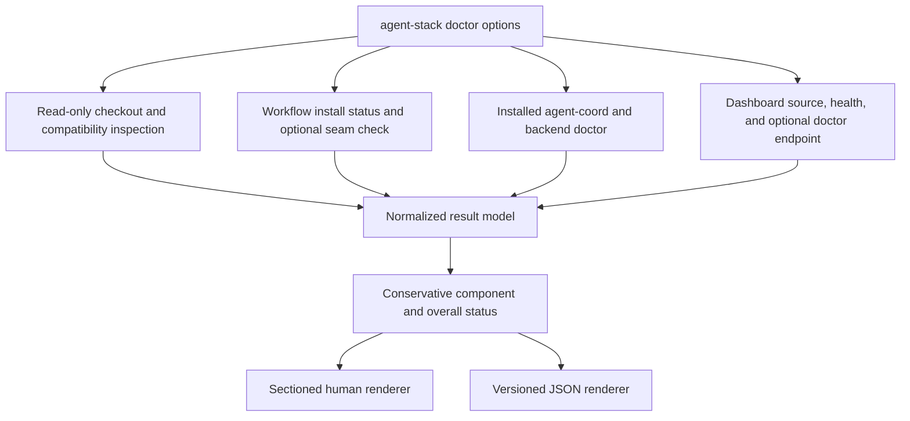

# Master Agent Stack Doctor - Plan

## Goal Capsule

- **Objective:** Add one read-only `agent-stack doctor` command that explains the health of `agent-workflows`, `agent-coordination`, and `agent-coordination-dashboard` in a clear terminal report and an equivalent stable JSON document.
- **Authority:** Preserve the user's requested three-part master surface, the existing child diagnostic contracts, repository portability rules, and secret-redaction guarantees in that order.
- **Execution profile:** Standard single-repository CLI change in `agent-workflows`; consume sibling diagnostics without requiring coordinated changes or lockstep releases.
- **Stop conditions:** Stop if the implementation would need to mutate stack state, expose credentials, change a child command's JSON or exit contract, or require a second repository change.
- **Tail ownership:** The LFG caller owns simplification, review, verification, commit, PR publication, and CI follow-through after implementation returns.

---

## Product Contract

### Summary

Add `agent-stack doctor` as the canonical local health command for the full three-repository stack.
It will replace flat field dumps with an overall verdict, one concise section per component, and actionable remediation while preserving a versioned automation contract through `--json`.

### Problem Frame

Operators currently run component diagnostics separately, and the visible `agent-coord doctor --deep` output is a flat list that can say `status: ok` while relegating unsupported or unavailable capabilities to a trailing degraded list.
That shape does not answer whether the full local stack is usable, which component is unhealthy, what evidence was unavailable, or what the operator should do next.
The stack already has structured diagnostic primitives, so the missing product is a conservative aggregator and formatter rather than another independent health implementation.

### Requirements

#### Master entrypoint and coverage

- R1. `agent-stack doctor` is the single read-only diagnostic entrypoint for the three named stack components while each existing component doctor remains independently callable.
- R2. The command inspects all three source checkouts and compatibility links, the installed workflow pack, the installed `agent-coord` command and coordination backend, and the optional running dashboard process.
- R3. The doctor accepts the non-mutating location selectors it consumes (`--source-root`, `--compat-root`, `--host`, `--target`, and `--agent-coord-install-dir`) plus loopback-only `--dashboard-url`, `--deep`, and `--json`.
- R4. Default diagnostics are bounded and inexpensive; `--deep` adds the workflow seam check for the known workflow checkout, coordination resource checks, and dashboard `/api/doctor` evidence without fetching, installing, starting, syncing, repairing, following HTTP redirects, or otherwise changing state.

#### Human and machine output

- R5. Human output leads with the overall verdict and component counts, then renders exactly three labeled component sections with meaningful check names, relevant configuration or version context, and remediation for every non-healthy result.
- R6. Human output omits empty keys and never concatenates raw child text; stable textual tokens distinguish healthy, degraded, failed, unknown, unsupported, and skipped evidence without relying on color or Unicode symbols.
- R7. `--json` writes JSON only to stdout and exposes a versioned aggregate schema with overall status, mode, timestamp, fixed component identifiers, stable check identifiers, normalized statuses, summaries, evidence, and guidance; deep-only check IDs remain present as intentional `skipped` records in default mode.
- R8. Human and JSON output are two renderings of one normalized result model, so every visible verdict and remediation has the same underlying check identity and status.
- R9. Neither rendering includes token values, URL credentials, secret-bearing environment values, raw terminal control sequences, or unfiltered child stderr.

#### Verdict and compatibility semantics

- R10. Overall status is `healthy` only when all required evidence is known-good, `degraded` when optional evidence is unavailable or an advisory limitation exists, and `failed` when required evidence is unusable, unavailable, unknown, timed out, or malformed.
- R11. Exit codes are `0` for healthy, `1` for degraded, `2` for failed, and `64` for usage errors; JSON status remains the authoritative semantic detail.
- R12. A stopped dashboard is degraded with launch guidance because `agent-stack sync` does not start or install it; a missing source checkout or unusable installed coordination command is failed.
- R13. Timed-out, malformed, unauthorized, unsupported, filtered, and skipped child evidence is preserved explicitly and never rounded up to healthy based only on a child exit code or top-level `status` field; an intentional mode-based skip does not lower the verdict.
- R14. The master accepts the currently deployed workflow-status, coordination-doctor, dashboard-health, and dashboard-doctor payloads, ignores unknown additive fields, and provides upgrade guidance for a missing required field or unsupported breaking shape.

### Acceptance Examples

- AE1. Given healthy source checkouts, matching workflow installation, a readable coordination backend, and a running healthy dashboard, when an operator runs the deep doctor, then the report says the stack is healthy and shows three healthy component sections.
- AE2. Given a healthy source and coordination setup with no dashboard process on the configured local URL, when the doctor runs, then it reports the dashboard as not running, marks the stack degraded, provides a start command, and exits `1`.
- AE3. Given `agent-coord doctor --deep --json` exits `0` but reports an unsupported, forbidden, filtered, or degraded resource, when the master normalizes it, then the coordination component and overall report remain visibly degraded rather than healthy.
- AE4. Given a child command times out, exits nonzero with prose, or emits malformed JSON, when the master runs with `--json`, then stdout is still a valid aggregate JSON document whose affected check names the unavailable or failed evidence.
- AE5. Given a dashboard `/api/health` response succeeds but `/api/doctor` is forbidden, slow, or malformed, when the deep doctor runs, then dashboard process health remains known while diagnostic confidence is degraded separately.
- AE6. Given a custom source root, install target, coordination install directory, or dashboard URL, when the matching selector is provided, then the report evaluates that installation rather than the defaults without creating any missing directory.
- AE7. Given a non-loopback dashboard URL, redirect response, credential-bearing URL, oversized child payload, or terminal-control sequence, when doctor evaluates the input, then it rejects or sanitizes the value without probing the remote target, spoofing terminal output, or exposing the credential.
- AE8. Given no configured coordination backend and no existing implicit local state root, when doctor runs, then it reports the backend as failed with setup guidance without invoking the child doctor or creating the default directory.

### Scope Boundaries

#### Included

- The ShakaCode-specific `agent-stack` command, its aggregate JSON contract, its human formatter, focused fixtures, user documentation, and changelog entry.
- Read-only consumption and normalization of existing child diagnostics.

#### Deferred to Follow-Up Work

- Remote dashboard diagnostics, historical health telemetry, concurrent probes for latency reduction, and a separately versioned dashboard doctor contract.

#### Outside This Product's Identity

- Automatic sync, install, package installation, dashboard startup, credential rotation, state repair, or mutation of any child repository.
- Reformatting or changing the JSON and exit behavior of `agent-coord doctor`, `agent-workflows-status`, or dashboard endpoints.

---

## Planning Contract

### Assumptions

- The dashboard's default local URL is `http://127.0.0.1:${PORT:-4319}` and an explicit loopback HTTP `--dashboard-url` overrides it.
- Source and installed/runtime evidence are both useful: source checkout integrity proves the stack can be developed or synced, while installed/runtime checks prove the tools an operator invokes are usable.
- Dashboard `/api/doctor` remains a best-effort child payload whose details are normalized behind the master schema rather than becoming a new cross-repository versioning dependency.
- A stopped dashboard is an expected idle condition and therefore degraded, while a running process with a broken health response is failed.

### Key Technical Decisions

- KTD1. **Dispatch before sync setup.** `doctor` branches before `physical_dir`, runtime preparation, fetch, link, or install code so diagnostics cannot create paths or mutate the stack.
- KTD2. **One normalized result model.** Probes produce stable component and check records, and both renderers consume that model; child human output is never parsed or printed.
- KTD3. **Preflight coordination before invoking its doctor.** The adapter first runs `agent-coord version --json`, resolves an explicitly configured HTTP or GitHub backend or an already-existing local root, and invokes `agent-coord doctor --json` only with that explicit backend; an absent implicit local root becomes failed evidence without child invocation.
- KTD4. **Inspect payload content, not exit alone.** Workflow status exit values, coordination `degraded` notes and per-resource results, and dashboard per-resource states map through explicit adapters before overall status is derived.
- KTD5. **Keep the installed command self-contained.** Implement the doctor within `bin/agent-stack` and use an embedded Ruby standard-library runner for JSON handling, bounded process groups, and bounded HTTP so the existing single-file installation and update path remains valid on macOS without a separate `timeout` dependency.
- KTD6. **Bound and sanitize every external edge.** Child process groups receive TERM then KILL cleanup; stdout and HTTP bodies are capped at 1 MiB, stderr at 64 KiB, and request duration is bounded. Oversized, nonzero, timed-out, malformed, or unexpected results become normalized evidence, while all external strings have credentials and terminal controls removed before entering the shared model.
- KTD7. **Conservative status ordering.** Failed required evidence dominates degraded evidence, degraded evidence dominates healthy, and missing observational evidence stays visible in the affected check's detail.
- KTD8. **Keep dashboard diagnostics local.** Accept only plain HTTP URLs with an exact `localhost`, `127.0.0.1`, or `[::1]` host and no userinfo; reject other schemes, hosts, and redirects as usage errors.

### High-Level Technical Design



The text and JSON outputs share this data flow; renderer disagreement is therefore a test failure rather than an accepted presentation difference.

### Human Report Shape

The transcript below fixes hierarchy, not exact spacing. Status words are always present; optional color is redundant, disabled for non-TTY output, and suppressed when `NO_COLOR` is set.

```text
Agent Stack Doctor: DEGRADED
3 components: 2 healthy, 1 degraded

[HEALTHY] agent-workflows
  Source     main @ 6271fea (clean)
  Install    0.1.0, up to date (Codex, flat)
  Checks     4 healthy

[HEALTHY] agent-coordination
  CLI        0.1.0
  Backend    http · https://example.invalid
  Checks     5 healthy

[DEGRADED] agent-coordination-dashboard
  Source     main @ 9fade4c (clean)
  Service    not running · http://127.0.0.1:4319
  Next       Start it from the dashboard checkout with `npm run dev`.
```

Within each component, non-healthy checks precede healthy context, supporting evidence is indented below its check, and each non-healthy check owns one `Next` line. Default mode adds one concise deep-check cue per affected component; JSON retains every deep-only check ID with `status: skipped`, its reason, and `--deep` guidance.

### Status and Criticality Mapping

| Check family | Criticality | Healthy/advisory mapping | Unavailable or invalid mapping |
|---|---|---|---|
| Source checkout and package/command contract | Required | Clean or dirty/wrong-branch context is healthy or degraded as named below | Missing checkout, invalid origin, malformed package metadata, or missing required command is failed |
| Compatibility link | Advisory | Correct is healthy | Missing or mismatched is degraded |
| Workflow installation | Required | Up to date is healthy; upgrade available is degraded | Not installed, invalid metadata, timeout, or malformed payload is failed |
| Workflow seam in deep mode | Required when run | Pass is healthy; intentional default-mode skip is neutral | Issues, timeout, or malformed payload is failed |
| Coordination backend | Required | Readable is healthy; scoped, filtered, or unsupported non-core resources are degraded | Missing explicit backend, authentication/read failure, timeout, or malformed payload is failed |
| Dashboard source | Required | Valid checkout/package contract is healthy | Missing checkout or malformed package contract is failed |
| Dashboard process | Advisory | Healthy response is healthy | Stopped is degraded; reachable but explicitly unhealthy or malformed health response is failed |
| Dashboard deep evidence | Advisory | Healthy resource reads are healthy; intentional default-mode skip is neutral | Forbidden, timed-out, oversized, malformed, or unavailable doctor evidence is degraded when health remains good |

Dirty or non-main source state is diagnostic context and degrades sync readiness without making the component unusable. Component and overall verdicts derive mechanically from this table: any failed check yields failed, otherwise any degraded check yields degraded, otherwise healthy.

### Evidence Matrix

| Component | Always checked | Deep-only evidence | Not inferred |
|---|---|---|---|
| `agent-workflows` | Source checkout, origin/branch/revision/dirty state, compatibility link, installed pack status and delivery mode | Known source checkout seam contract | Network freshness unless explicitly added later |
| `agent-coordination` | Source checkout, compatibility link, installed command/version, explicit backend doctor | Per-resource doctor results and machine scope metadata | Backend health from exit code alone or creation of an implicit local root |
| `agent-coordination-dashboard` | Source checkout, package version, compatibility link, local `/api/health` | Fresh `/api/doctor` per-resource evidence | A stopped service as a broken checkout or backend |

### Risks and Mitigations

- **Conflicting child semantics:** Child exit codes and payload status fields do not share one meaning. Mitigate with named adapters and fixture coverage for every observed state.
- **False health from missing evidence:** A timeout or parse error can otherwise disappear behind a successful sibling check. Mitigate by retaining unknown evidence and deriving status conservatively.
- **Secret leakage:** Child stderr or configuration can contain operational detail. Mitigate by allowlisting displayed fields, synthesizing errors, and testing with sentinel secrets.
- **Terminal or payload injection:** Allowed fields can still carry credentials, escape sequences, newlines, or oversized values. Mitigate with size ceilings plus centralized redaction and control-character escaping before the normalized model is built.
- **Doctor mutation:** Reusing sync path helpers can create directories or update refs. Mitigate by early dispatch, non-creating path normalization, no `--fetch`, and before/after filesystem assertions.
- **Formatting drift:** Separate human and JSON logic can disagree over time. Mitigate with a shared model and parity assertions keyed by stable check IDs.

---

## Implementation Units

### U1. Read-only diagnostic model and component probes

- **Goal:** Add doctor command dispatch, option handling, bounded probes, normalization adapters, and deterministic status/exit derivation to the standalone stack command.
- **Requirements:** R1-R4, R7, R9-R14; AE2-AE6.
- **Dependencies:** None.
- **Files:** `bin/agent-stack`, `bin/agent-stack-test.bash`.
- **Approach:** Branch before all sync setup; validate local-only selectors; use the embedded Ruby runner to collect bounded checkout, install, coordination, and dashboard evidence into fixed component records; preflight coordination so an implicit local root is never created; sanitize before normalization; synthesize failures without allowing `set -e` to abort the aggregate.
- **Execution note:** Start with failing fixture tests for status precedence, non-creating path resolution, malformed child output, and the exit-0 degraded coordination payload.
- **Patterns to follow:** Existing root-selector parsing and repository URL validation in `bin/agent-stack`; JSON and exit semantics in `bin/agent-workflows-status`; isolated temporary origins and commands in `bin/agent-stack-test.bash`.
- **Test scenarios:**
  - Healthy default and deep runs produce three healthy component records and exit `0`.
  - A custom source, compatibility, runtime, target, install, or dashboard location is used without creating missing paths.
  - Missing checkout or installed coordination command is failed and exits `2`.
  - Stale workflow installation, stopped dashboard, unsupported coordination resource, or unavailable deep dashboard evidence is degraded and exits `1`.
  - Child nonzero exit, timeout, malformed JSON, unexpected payload, and HTTP auth/read failure remain represented in the aggregate.
  - Process-group timeout cleanup leaves no descendant process; oversized stdout, stderr, or HTTP bodies stop at their documented ceilings.
  - Non-loopback, redirected, and credential-bearing dashboard URLs are rejected before any request.
  - An absent implicit coordination root remains absent after doctor and produces setup guidance.
  - Deep mode invokes only the additional documented read checks and never fetches or mutates state.
- **Verification:** Focused tests prove every probe state maps to the intended normalized status and exit code and leaves fixture paths and repositories unchanged.

### U2. Human and JSON renderers

- **Goal:** Render the shared diagnostic model as a concise operator report and a stable automation document.
- **Requirements:** R5-R9, R11-R14; AE1-AE5.
- **Dependencies:** U1.
- **Files:** `bin/agent-stack`, `bin/agent-stack-test.bash`.
- **Approach:** Print the defined overall-first hierarchy followed by exactly three sections, textual status tokens, non-healthy-first checks, supporting context, and one next action per non-healthy check; emit a schema-versioned JSON document from the same records with JSON-only stdout.
- **Patterns to follow:** Stable JSON fields and guidance strings from `bin/agent-workflows-status`; concise helper output assertions in existing `bin/*-test` suites.
- **Test scenarios:**
  - Healthy, degraded, and failed fixtures render the same component/check statuses in text and JSON.
  - Empty or inapplicable child fields are omitted from text while normalized JSON keys remain stable.
  - Every non-healthy text item includes the same remediation attached to its JSON check.
  - JSON mode contains no headings, progress prose, child stdout, or stderr and parses after all child failure modes.
  - Intentional default-mode skips remain stable JSON records and concise human cues without lowering the verdict.
  - Non-TTY and `NO_COLOR` output retains every distinction through text alone.
  - Sentinel API tokens, URL credentials, secret environment values, ANSI escapes, carriage returns, and embedded newlines never appear unsanitized in either output or synthesized errors.
- **Verification:** Snapshot-style assertions and JSON parsing demonstrate human/JSON parity, readable hierarchy, stable check IDs, and redaction.

### U3. User-facing contract and release notes

- **Goal:** Document the master command, modes, selectors, verdicts, exit codes, JSON contract, and relationship to component doctors.
- **Requirements:** R1-R4, R7, R10-R14.
- **Dependencies:** U1, U2.
- **Files:** `README.md`, `docs/installation-and-upgrades.md`, `CHANGELOG.md`.
- **Approach:** Put the command in full-stack contributor setup and status guidance, explain that dashboard runtime is optional, and state that doctor is observational and never repairs the stack.
- **Patterns to follow:** Existing full-stack setup and stable-token tables in `docs/installation-and-upgrades.md`; Unreleased entries in `CHANGELOG.md`.
- **Test scenarios:** Test expectation: none -- documentation mirrors the executable contract and is covered by repository documentation/link validation.
- **Verification:** The documented flags, defaults, statuses, and exits match help output and tests with no stale component-specific recovery guidance.

---

## Verification Contract

| Gate | Command | Covers | Done signal |
|---|---|---|---|
| Focused stack helper suite | `bash bin/agent-stack-test.bash` | U1, U2 | All healthy, degraded, failure, timeout, redaction, parity, selector, and non-mutation fixtures pass. |
| Repository validation | `bin/validate` | U1-U3 | Full metadata, helper, installer, documentation, schema, and style validation passes. |
| Human smoke check | `bin/agent-stack doctor --deep` | U1-U3 | Output begins with an honest verdict and renders three informative sections with actionable degraded dashboard guidance when it is stopped. |
| JSON smoke check | `bin/agent-stack doctor --deep --json` | U1, U2 | Output parses as JSON, contains the fixed three components and schema version, and matches the human verdict without exposing secrets. |

---

## Definition of Done

- `agent-stack doctor` diagnoses all three stack components from one command without changing any checkout, ref, filesystem root, install, runtime, or backend state.
- Human output is sectioned, concise, informative, and actionable rather than a flat key/value dump.
- The stable JSON model, status precedence, and `0/1/2/64` exit contract are documented and protected by tests.
- Child diagnostic compatibility is preserved, including exit-0 degraded coordination payloads and stopped-dashboard behavior.
- Current child payload shapes and additive unknown fields are accepted; breaking or incomplete shapes produce explicit upgrade guidance rather than parser crashes.
- Focused and repository-wide validation pass, documentation and changelog are updated, and no sentinel secret appears in captured output.
- Dead-end helpers, duplicate formatting paths, experimental probes, and other abandoned implementation artifacts are removed from the final diff.
