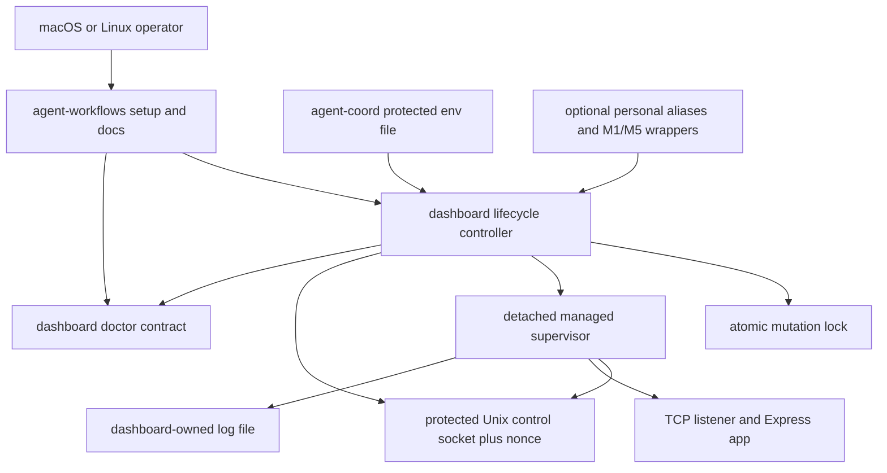
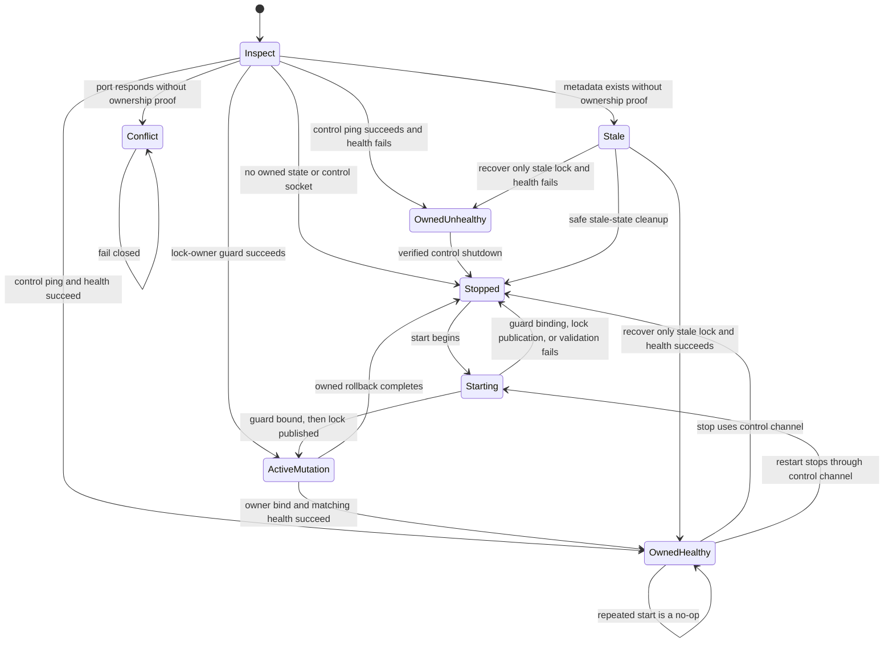

# Portable Dashboard Lifecycle - Plan

## Goal Capsule

- **Objective:** Give any macOS or Linux user a public, credential-safe way to install, start, stop, restart, inspect, and recover the agent coordination dashboard without private dotfiles or tmux.
- **Product authority:** The dashboard package owns dashboard lifecycle behavior; `agent-workflows` owns full-stack installation and contributor setup; consumer dotfiles remain optional conveniences.
- **Execution profile:** Cross-repository code, tests, setup documentation, and migration work across `agent-coordination-dashboard`, `agent-workflows`, `agent-coordination`, and `private-dotfiles`.
- **Stop conditions:** Stop rather than guess if the public environment-file contract changes upstream, ownership cannot be proven without signaling an arbitrary PID, or the doctor PRs invalidate the diagnostic seams below.
- **Tail ownership:** The executor owns dependency ordering, verification, PR publication, and the migration handoff until public lifecycle management replaces the private tmux implementation.

The `artifact_contract` and `product_contract_source` frontmatter preserve provenance from the external planning workflow; this repository does not define or validate those metadata schemas.

---

## Product Contract

### Summary

The public agent stack will provide a portable dashboard lifecycle command and a documented setup path for macOS and Linux. Every managed process launch, including start from stopped and the replacement created by restart, will load current private configuration instead of inheriting credentials from a persistent shell or terminal service; start against an owned healthy process remains a no-op.

### Problem Frame

The current dashboard lifecycle helper lives in a private dotfiles repository and uses tmux to keep the development server alive. Because the tmux server retains a global environment, restarting the dashboard can reuse a removed or rotated token even when the current shell and `agent-coord doctor --deep` use the new token.

The public full-stack setup already installs the workflow and coordination tools, prepares private runtime storage, and checks out the dashboard. It does not install a public dashboard lifecycle command, leaving contributors dependent on private shell configuration or manual foreground commands.

### Actors

- A1. **Operator:** Installs and runs the local agent stack on macOS or Linux.
- A2. **Dashboard lifecycle command:** Owns process startup, shutdown, health verification, logs, and configuration reload.
- A3. **Full-stack installer:** Installs public commands, prepares private runtime storage, and guides verification.

### Requirements

**Portable lifecycle**

- R1. The public dashboard package must provide start, stop, restart, status, logs, open, and explicit stale-state recovery operations on supported macOS and Linux hosts.
- R2. The lifecycle command must not require tmux, a shell profile, or private dotfiles.
- R3. Repeated start, stop, and restart operations must be idempotent and must not terminate an unrelated process occupying the configured port.
- R4. The lifecycle command must retain a foreground server invocation for development, containers, and external process supervisors.
- R16. Lifecycle mutations must be serialized with an atomic directory lock whose owning controller publishes an authenticated liveness guard before the lock becomes visible. Runtime files must be written atomically with restrictive permissions, and ambiguous stale locks or malformed state must fail closed until an explicit `recover` operation proves the lock-owning controller unreachable and revalidates the lock identity. If an authenticated managed-instance channel remains reachable, recovery may retire only the stale controller lock and must preserve the live instance. If control is unreachable but the exact recorded supervisor process identity is still live, recovery must fail closed; it may quarantine instance artifacts only after proving that recorded process identity exited or was replaced.
- R17. Stop and restart must prove ownership through a protected local control channel; a port or unverified PID is never sufficient authority to signal a process.
- R23. The control channel must require a secret per-start random nonce with at least 128 bits of entropy that matches protected mode-`0600` metadata so a substituted or stale socket cannot authorize shutdown.

**Configuration and credential safety**

- R5. Every managed process launch, including start from stopped and the replacement created by restart, must delete every managed allowlisted coordination and dashboard key from the inherited environment before loading current configuration from the public `agent-coord` mode-`0600` environment file selected by its documented default or explicit override; start against an owned healthy process must not reload it.
- R6. A removed API URL or token must clear the corresponding value for the new dashboard process rather than inherit an older value.
- R7. Tokens must not appear in process arguments, log output, issue text, committed files, or persistent launcher metadata.
- R8. Startup must fail safely when API mode is selected without the required token or when the owned dashboard cannot establish local control and shallow HTTP readiness bound to the exact managed supervisor by a direct listening acknowledgement and matching instance identity. The single detached managed supervisor must own both authenticated control and the TCP listener, so process death closes both in the kernel without relying on a child event loop. It may not bind TCP until it publishes authenticated ownership and the launching controller verifies that publication and sends an explicit `continue` acknowledgement. Caller death before that acknowledgement leaves no listener; caller death afterward may leave only a discoverable managed supervisor whose control, metadata, process identity, and listener share one owner.
- R18. Managed startup must reject missing, symlinked, non-regular, unreadable, or over-permissive environment files and must preserve logs while removing partial lifecycle state after failed validation.
- R21. Backend authentication or reachability failures discovered after local readiness must leave the dashboard available in degraded GitHub-only mode and surface nonzero deep diagnostics.
- R22. Managed environment files must accept only documented coordination and dashboard keys, reject duplicate or shell-executable syntax, and be validated and read through the same no-follow file descriptor.
- R24. Lifecycle logs must be created without following symlinks, remain mode `0600`, rotate at 10 MiB per file, retain at most four rotated files plus the active file (50 MiB total), and redact credentials from diagnostics. A start or restart that cannot rotate or safely open its log must fail before TCP bind without truncating an existing file or following a substituted path; an already-running supervisor must report a non-secret diagnostic and stop accepting new log bytes rather than exceed the bound.

**Installation and diagnosis**

- R9. The full-stack setup must install or expose the dashboard lifecycle command alongside `agent-stack` and `agent-coord`.
- R27. Before dependency or command-install mutation, full-stack setup must prove that Node.js and npm are present and meet the dashboard's documented runtime and package-manager floors.
- R10. The versioned dashboard doctor contract must expose machine-readable lifecycle ownership and shallow-health state so full-stack diagnostics can distinguish an active mutation, a stopped optional dashboard, an owned unhealthy dashboard, stale or conflicting lifecycle state, and an unreachable coordination backend without duplicating component-owned logic.
- R26. Lifecycle success must depend on owned control and bounded shallow health, not optional summary or counts retrieval. Slow, empty, or malformed summary responses must not fail a successful lifecycle operation or emit a parser stack trace, and API-mode status must model the `coordination-api` state-root sentinel instead of comparing it with a local path.
- R11. Setup and recovery documentation must cover installation, private configuration, first start, status, logs, deep diagnosis, token rotation, restart, and removal.
- R12. The documented recovery sequence must verify the CLI backend from the exact selected protected environment file before restarting the dashboard and verify dashboard health afterward.
- R25. `agent-coordination` must own a machine-readable canonical environment-file discovery contract that dashboard and workflow installers consume, plus a secret-safe deep-doctor option that parses that selected file through the canonical grammar before backend/default resolution, clears absent managed coordination keys from ambient state, rejects conflicting explicit backend-source options, and never exposes its values.

**Migration and repository boundaries**

- R13. Public setup must not depend on `justin808/private-dotfiles` or any machine-specific alias, hostname, SSH topology, or secret store.
- R14. Personal dotfiles may retain aliases and cross-machine wrappers that call the installed public commands without reimplementing lifecycle behavior.
- R15. Existing authentication-recovery documentation must reference the public launcher rather than the private tmux workaround.
- R19. Public setup must standardize on the dashboard package's `4319` default and document migration from the private launcher's `4317` default without auto-stopping the old process.
- R20. Lifecycle locks, ownership metadata, control sockets, and logs must live in dashboard-owned local state rather than coordination data storage.

### Key Flows

- F1. **First-time setup**
  - **Trigger:** A1 installs the full agent stack on macOS or Linux.
  - **Actors:** A1, A3
  - **Steps:** Setup installs the public commands, creates protected runtime storage, directs A1 to configure the backend, and verifies the CLI before starting the dashboard.
  - **Outcome:** A1 can start and inspect the dashboard without private shell configuration.
  - **Covered by:** R1, R2, R5, R9, R11

- F2. **Normal restart**
  - **Trigger:** A1 updates the stack or requests a dashboard restart.
  - **Actors:** A1, A2
  - **Steps:** The lifecycle command stops only its owned process, reloads current private configuration, starts a replacement, and verifies health.
  - **Outcome:** The running dashboard reflects the current configuration and reports a usable status.
  - **Covered by:** R3, R5, R6, R8, R12, R26

- F3. **Credential rotation recovery**
  - **Trigger:** The coordination backend rejects a removed or rotated machine token.
  - **Actors:** A1, A2, A3
  - **Steps:** A1 updates the protected environment file, runs deep CLI diagnostics with that exact selected file through the canonical parser, restarts the dashboard, and runs stack or dashboard diagnostics.
  - **Outcome:** Both the CLI and dashboard authenticate with the same current identity and scopes.
  - **Covered by:** R5, R6, R7, R8, R10, R12

- F4. **Private-dotfiles migration**
  - **Trigger:** The public lifecycle command becomes available.
  - **Actors:** A1, A2
  - **Steps:** A1 replaces the private launcher with optional aliases that invoke the public command and removes the tmux-specific workaround.
  - **Outcome:** Personal configuration contains no duplicate lifecycle implementation.
  - **Covered by:** R13, R14, R15

### Acceptance Examples

- AE1. **Fresh public install**
  - **Covers:** R1, R2, R9, R11, R27
  - **Given:** A supported host with no private dotfiles and no tmux installation
  - **When:** The operator follows the public full-stack setup and starts the dashboard
  - **Then:** Setup checks Node.js and npm before install mutation, the dashboard runs in the background, status succeeds, and logs are available through the public command; a missing or old runtime instead fails early with prerequisite guidance and no partial tool install

- AE2. **Rotated token**
  - **Covers:** R5, R6, R7, R8, R12
  - **Given:** A running dashboard authenticated with an old token and a protected environment file containing its replacement
  - **When:** The operator runs deep CLI verification against that exact file and restarts the dashboard
  - **Then:** CLI verification and the replacement process use the new token through the same canonical file grammar, the old value is not inherited, and no token appears in command lines or logs

- AE3. **API mode disabled**
  - **Covers:** R5, R6, R8
  - **Given:** A previous process used the HTTP coordination backend
  - **When:** The operator removes the API configuration and restarts
  - **Then:** The new process uses filesystem mode and does not retain the previous API URL or token

- AE4. **Unrelated port listener**
  - **Covers:** R3
  - **Given:** Another process occupies the configured dashboard port
  - **When:** The operator runs start, restart, or stop
  - **Then:** The lifecycle command reports the ownership conflict without killing the unrelated process

- AE5. **Concurrent lifecycle requests**
  - **Covers:** R3, R16, R17
  - **Given:** Two operators or scripts request start or restart at the same time
  - **When:** Both lifecycle mutations reach the same runtime directory
  - **Then:** One mutation owns the lock, the other exits predictably, status and doctor report a degraded `active_mutation` state with the operation name while the guard is reachable, and only one owned dashboard remains

- AE6. **Failed managed startup**
  - **Covers:** R7, R8, R16, R18
  - **Given:** The selected environment file is unsafe or the owned dashboard cannot establish local control and shallow HTTP readiness
  - **When:** The operator starts or restarts the dashboard
  - **Then:** Startup succeeds only after the single managed supervisor publishes authenticated ownership, the controller verifies it and sends `continue`, the supervisor reports that it bound its own listener, and shallow health returns the same random instance identity; otherwise startup fails without exposing credentials or killing an unverified process. Caller death before `continue` leaves no listener, caller death afterward leaves at most that discoverable owner, and killing the supervisor closes both control and TCP in the kernel even when its event loop was wedged immediately beforehand

- AE7. **Already-running start after configuration change**
  - **Covers:** R3, R5, R6
  - **Given:** An owned healthy dashboard is already running and the environment file has changed
  - **When:** The operator runs start
  - **Then:** Start reports that the existing process was not reloaded and directs the operator to restart

- AE8. **Private launcher migration**
  - **Covers:** R13, R14, R15, R19
  - **Given:** The tmux-based private launcher still owns a dashboard on port `4317`
  - **When:** The operator installs the public lifecycle command
  - **Then:** Setup identifies the old listener as unowned, documents its explicit shutdown, and starts the public dashboard on `4319` only after the conflict is resolved

- AE9. **Backend authentication degradation**
  - **Covers:** R8, R10, R21
  - **Given:** An owned dashboard has local control and shallow HTTP health but the coordination backend returns `401`
  - **When:** Managed startup or deep diagnosis checks coordination resources
  - **Then:** The dashboard remains available with GitHub-only data, deep diagnostics return nonzero with recovery guidance, and no credential appears in output

- AE10. **Hostile local lifecycle artifacts**
  - **Covers:** R16, R18, R22, R23, R24
  - **Given:** A local path is replaced after inspection, a fake control socket responds, or a log path is a symlink
  - **When:** A lifecycle mutation validates and uses those artifacts
  - **Then:** The command rejects the artifact or requires explicit recovery without signaling a process, overwriting a target, or exposing a secret

- AE11. **Ambiguous stale lock**
  - **Covers:** R16
  - **Given:** A lifecycle lock remains after its controller guard becomes unreachable, with either a reachable authenticated managed instance or no reachable managed instance
  - **When:** The operator runs start, stop, or restart and then invokes `recover`
  - **Then:** Normal lifecycle verbs do not reclaim the lock automatically; after stable lock-identity revalidation, `recover` removes only the stale controller lock when authenticated managed control is reachable, or quarantines both lock and stale instance artifacts when managed control is also unreachable, while an indeterminate probe fails closed

- AE12. **Healthy server with unavailable summary**
  - **Covers:** R10, R26
  - **Given:** The owned dashboard passes control and shallow health checks while an optional dashboard summary is slow, empty, malformed, or reports the API-mode state-root sentinel
  - **When:** The operator starts, restarts, or checks status
  - **Then:** The lifecycle operation preserves its successful result, emits no parser stack trace, and status distinguishes a healthy server with unavailable summary data from a stopped or unhealthy server

### Success Criteria

- A new macOS or Linux operator can install and manage the dashboard using only public repositories and documented commands.
- Token rotation recovery leaves both deep CLI diagnostics and dashboard diagnostics healthy without restarting a terminal multiplexer.
- The private dotfiles launcher can be removed without losing dashboard lifecycle functionality.
- Existing stack diagnostics consume component-owned contracts and remain secret-safe.

### Scope Boundaries

- Automatic startup through launchd, systemd, or desktop login items is deferred.
- Windows-native lifecycle support is deferred.
- Hosted dashboard deployment and remote multi-user operations are outside this local lifecycle feature.
- Personal cross-machine synchronization, SSH aliases, and secret-store preferences remain outside public stack behavior.

### Dependencies and Assumptions

- The dashboard package remains the public owner of its executable and health contract.
- The full-stack setup remains distinct from the generic consumer-repository skill installer, even as it becomes usable by any agent-stack contributor.
- Open stack-doctor work in `agent-workflows` and the dashboard should be reused rather than copied into the lifecycle command.
- Public lifecycle work should supersede the tmux-specific private-dotfiles workaround and update the authentication-recovery documentation that currently depends on it.

### Sources and Research

- `bin/agent-stack` and `docs/installation-and-upgrades.md` define the current full-stack setup and protected runtime root.
- The dashboard package manifest and README define the executable and runtime configuration contract.
- [agent-workflows issue #159](https://github.com/shakacode/agent-workflows/issues/159) tracks public installation and rollout; [agent-coordination-dashboard issue #63](https://github.com/shakacode/agent-coordination-dashboard/issues/63) tracks the dashboard-owned lifecycle command and records the 2026-07-16 failure evidence for slow optional summaries and API-mode state-root handling.
- [agent-workflows PR #152](https://github.com/shakacode/agent-workflows/pull/152) defines the active stack-doctor direction; merged [agent-coordination-dashboard PR #59](https://github.com/shakacode/agent-coordination-dashboard/pull/59) supplies the component-owned dashboard doctor contract.
- [agent-workflows PR #156](https://github.com/shakacode/agent-workflows/pull/156) documents authentication recovery but currently depends on [private-dotfiles PR #36](https://github.com/justin808/private-dotfiles/pull/36).
- [Node.js child process documentation](https://nodejs.org/docs/latest-v22.x/api/child_process.html#optionsdetached) defines detached-process, `unref`, and redirected-stdio behavior used by the launcher.
- [Node.js `util.parseEnv` documentation](https://nodejs.org/docs/latest-v22.x/api/util.html#utilparseenvcontent) supplies data-only dotenv parsing at the package's supported Node floor; the plan adds an allowlist because parsing does not make arbitrary environment keys safe.

---

## Planning Contract

The Product Contract above is preserved from the confirmed brainstorm scope. The decisions below resolve implementation shape without widening the product to login services, Windows support, hosted operation, or private-machine policy.

### Key Technical Decisions

- KTD1. **Keep lifecycle ownership in the dashboard package.** The package already owns the executable, server configuration, health endpoint, and public npm contents. `agent-workflows` installs and invokes this interface instead of encoding Node process details.
- KTD2. **Keep authenticated control and the HTTP listener in one managed owner.** The launching controller spawns one detached managed supervisor over a private startup channel. Before TCP bind, the supervisor binds the nonce-authenticated Unix control socket, atomically publishes protected metadata containing its exact process-birth identity, reports `ownership_published`, and waits. The controller must verify the same metadata identity plus authenticated control and reply `continue`; channel EOF or any non-acknowledgement makes the supervisor remove its pre-listener state and exit without binding TCP. Only after `continue` may it create the existing Express application in-process and own the TCP listener directly. Its listening acknowledgement and `/api/health` response must carry the same separate random public instance identifier, so control, process identity, listening acknowledgement, and shallow health agree. The controller releases its mutation lock after that evidence. If the controller dies before `continue`, no TCP listener exists; if it dies afterward, the acknowledged supervisor remains a recoverable managed owner rather than an orphan. If the supervisor dies or is killed, the OS closes both control and TCP descriptors even if its event loop was stopped or wedged, so cleanup never depends on a descendant handling EOF. Foreground invocation remains a separate unchanged process path. The secret nonce authorizes control; the public identifier and verified process-birth record bind observations but are not accepted alone as stop authority.
- KTD3. **Model lifecycle state explicitly and fail closed.** The command distinguishes stopped, owned healthy, owned unhealthy, active mutation, stale state, and unowned port conflict. Before atomically publishing a directory lock, its controller establishes a protected nonce-authenticated local liveness guard and records that guard in the lock metadata; this prevents a slow startup from exposing a lock whose live owner cannot yet be probed. Normal verbs never auto-reclaim an ambiguous lock. A separate `recover` operation first proves the guard unreachable and the lock identity unchanged. It atomically retires only that stale lock when authenticated control reports a managed supervisor, preserving the live instance so normal stop or restart can proceed. If control is unreachable, recovery revalidates the recorded PID plus platform process-birth identity and fails closed while that exact supervisor is live; only a proven-exited or replaced identity permits quarantine of stale instance artifacts. Reachable guards, changed identities, live-but-unresponsive supervisors, or indeterminate probes remain intact and return nonzero guidance.
- KTD4. **Use the public coordination environment file as the single managed configuration authority.** `agent-coordination` resolves the `AGENT_COORD_ENV_FILE` override or canonical default through a machine-readable contract and lets deep doctor consume that pathname directly through a canonical secret-safe parser kept inside the existing self-contained `bin/agent-coord` distribution. The doctor parses and applies `--env-file` before any backend/default resolution, clears absent managed coordination keys, and rejects `--env-file` combined with explicit `--api-url`, `--state-root`, or `--backend` so source precedence cannot be ambiguous. In `--stack-json` mode the selected file is the sole backend selector; stack-wide doctor must discover that canonical path and delegate it explicitly instead of reconstructing coordination selection from ambient variables or runtime-root guesses. Doctor and managed start validate and read the same no-follow descriptor, enforce the same grammar and published cross-component key registry, and never print values; doctor applies only coordination-owned values while accepting registered dashboard keys. A versioned public corpus under `contracts/environment-file/`, included in the coordination gem, keeps source, installed CLI, dashboard, and workflow consumers aligned. Managed starts delete every managed coordination and dashboard key from the inherited environment, then apply registered file values including empty strings. This includes backend selectors and tokens plus keys such as `AGENT_COORD_STATE_ROOT`, `HOST`, `PORT`, `ALLOWED_HOSTS`, dashboard refresh/settings values, and legacy aliases.
- KTD5. **Keep foreground behavior additive and unchanged.** No-argument and existing server options continue to run in the foreground. Lifecycle subcommands enter a separate controller so development, containers, and external supervisors retain the existing contract.
- KTD6. **Share lifecycle classification with component and stack diagnosis.** One dashboard-owned classifier drives human lifecycle `status` and the schema-version-2 `dashboard.lifecycle` check in `doctor --stack-json`. The new dashboard doctor emits schema v2. Its check publishes stable `details.state` values for `active_mutation`, `stopped`, `owned_healthy`, `owned_unhealthy`, `stale`, and `unowned_conflict`; active mutation is degraded and includes `details.operation`, stopped makes both lifecycle and health checks skipped so the optional component aggregates healthy with exit 0, owned healthy is healthy, and owned unhealthy, stale, or conflict is failed. Older PR #59 dashboard installs continue to emit schema v1, where stopped remains degraded/exit 1. During rollout, `agent-stack doctor` accepts and preserves dashboard component schemas 1 and 2, updates its v2 stopped expectations, and continues to reject unknown versions; it aggregates the dashboard contract without recreating lifecycle probes. For coordination it discovers the canonical file from the component-owned machine-readable contract and invokes `agent-coord doctor --stack-json [--deep] --env-file PATH`, so the component remains the sole backend resolver. Optional summary or counts output is bounded, best-effort context that cannot change a lifecycle verb's result.
- KTD7. **Build on the active public seams.** Dashboard lifecycle work layers on the component-doctor contract merged by PR #59. Stack installation layers on the modular installer branch from PR #152. A new documentation follow-up against current `main` replaces the private-launcher guidance introduced by merged PR #156, and private PR #36 is reduced to personal wrappers or superseded.
- KTD8. **Use explicit startup in v1.** Detached processes, logs, and lifecycle commands are portable across supported macOS and Linux hosts. launchd and systemd units remain follow-up work because they add platform policy rather than lifecycle capability.
- KTD9. **Keep locally healthy dashboards running through backend degradation.** Startup readiness requires the owned control channel and shallow HTTP health. Deep backend diagnostics run afterward; authentication or reachability failure returns degraded/nonzero evidence while preserving the dashboard's GitHub-only surface.
- KTD10. **Discover a canonical loopback probe from verified lifecycle state.** Managed lifecycle accepts loopback bind hosts plus wildcard `0.0.0.0` and `::` binds with the existing `ALLOWED_HOSTS` protection; it rejects a specific non-loopback bind host while leaving foreground behavior unchanged. Protected metadata records the configured bind host separately from a canonical probe origin: `localhost` stays `localhost`, `127.0.0.1` and `0.0.0.0` probe `127.0.0.1`, and `::1` and `::` probe bracketed `[::1]`, always with the managed port. When `agent-stack doctor --dashboard-url` is explicit, that validated operator override is passed to the component doctor. Otherwise the stack doctor omits `--url`; the dashboard doctor prefers the verified probe origin and public instance identity only after authenticated control proves the managed instance, and falls back to `http://127.0.0.1:4319` only when no managed lifecycle state exists. A stale, conflicting, or active-mutation record is classified as such rather than probed at an ambient or guessed `PORT`.

### High-Level Technical Design

The diagram shows ownership and delegation. It is a boundary map, not a prescribed module graph.

The lifecycle state machine makes unsafe ambiguity terminal rather than destructive.

### Lifecycle and Configuration Contracts

- The dashboard runtime directory is package-owned local state and contains only the lock, control socket, protected metadata including the secret nonce, and logs. Coordination claims, heartbeats, batches, and events remain under `AGENT_COORD_STATE_ROOT`.
- The runtime root resolves from `AGENT_COORD_DASHBOARD_RUNTIME_DIR` or the XDG state home, falling back to `~/.local/state/agents-coordination-dashboard/lifecycle`. The same dashboard-owned resolver is used by commands, diagnostics, documentation, and tests.
- Before binding the Unix control socket, the resolver validates the encoded path against a conservative cross-platform byte limit. When the runtime-root path is too long, it uses a deterministic, per-user hashed socket path under a short mode-`0700` dashboard-owned directory in `/tmp`, verifies that directory without following symlinks, and keeps the selected path in protected metadata. macOS and Linux tests cover the long-path fallback.
- Each mutating controller binds its protected nonce-authenticated liveness guard before atomically publishing the lock directory and metadata. Status and doctor classify a reachable guard as `active_mutation` with its recorded operation. Recovery treats a reachable guard, changed lock identity, a live recorded supervisor identity, or an indeterminate probe as active or ambiguous ownership. After proving the guard unreachable and the lock identity stable, it retires only the stale lock when authenticated control reports the managed instance; it may quarantine instance artifacts only after proving the recorded process identity exited or was replaced.
- Metadata records the supervisor PID plus a platform process-birth identity, configured bind host, canonical loopback probe origin, public random instance identifier, and start time for observability. It also stores the secret control nonce with mode `0600`; status, doctor, logs, and captured tests must never emit the secret. Control requests must present the matching nonce before the managed supervisor answers ping or graceful shutdown. The public identifier may appear in shallow health only to bind that response to control and the supervisor's own listening acknowledgement; it is not accepted as authorization.
- Managed starts resolve protected files only beneath approved protected roots. They validate every ancestor as same-user-owned, non-symlink, and appropriately mode-restricted, retain and revalidate each ancestor's device/inode identity across final-file open, and fail closed if an ancestor is replaced. They then open the final file without following symlinks, validate ownership/type/mode from that descriptor, read from the same descriptor, reject unknown or duplicate keys and shell syntax, and never persist the resulting environment.
- Startup publishes and acknowledges a single owner before TCP bind. The supervisor first binds authenticated control and atomically records its exact process identity, reports publication, and waits. The controller reopens and verifies that protected record plus authenticated control before sending `continue`; EOF before the acknowledgement makes the supervisor exit without TCP. The supervisor then creates the existing Express application and TCP server in-process, acknowledges its own successful bind, and returns shallow health with the matching public identifier at the canonical loopback probe origin. The launching controller releases the mutation lock only after those observations agree. An unrelated listener that wins the port race cannot produce the supervisor acknowledgement and matching identifier, so it cannot satisfy readiness. Deep backend failure after local readiness leaves the dashboard running in degraded GitHub-only mode and preserves recovery evidence.
- Optional summary or counts retrieval uses a separate bounded budget, treats empty or malformed bodies as unavailable context without parsing crashes, and represents API-mode state root explicitly instead of comparing its sentinel with a filesystem path.
- Stop never escalates to signaling an unverified PID. If the control channel cannot prove ownership, the command reports stale state or conflict with recovery guidance.
- The detached managed supervisor owns the control socket and TCP listener in the same process and instantiates the existing server application directly. Authenticated shutdown closes the listener, bounds connection draining, destroys remaining connections, removes socket state, and exits. A hard supervisor death needs no cleanup callback to release the port because the kernel closes its descriptors.
- Normal lock release is limited to the controller that acquired the atomic directory. Ambiguous stale locks are not reclaimed during normal commands; explicit recovery is the only exception and may retire a stable lock whose controller guard is proven unreachable while preserving any authenticated live instance.
- `logs` creates no-follow mode-`0600` files, rotates the active file at 10 MiB, retains at most four rotated files plus the active file (50 MiB total), and reports a clear empty state before first launch. Rotation revalidates the protected ancestor chain and final descriptor; failure before a managed start aborts before TCP bind, while a running supervisor emits a non-secret diagnostic and refuses further log bytes rather than truncate, follow a replacement, or exceed the bound. `open` selects the platform opener through an injectable adapter.

### Threat Model

- In scope: accidental concurrent commands, stale state, unrelated listeners, hostile paths owned by another user, and local processes that cannot read the mode-protected runtime directory.
- Out of scope: a malicious or compromised process running as the same OS user. That actor can inspect the user's memory and protected files, so the lifecycle command must not claim same-user isolation it cannot provide.
- The nonce prevents accidental or different-user socket substitution within the OS permission boundary; it is lifecycle authentication material, not public instance metadata.

### Sequencing

1. Extend `agent-coordination` with the canonical machine-readable environment-file discovery contract.
2. Build on the merged dashboard component-doctor contract, then add dashboard-owned lifecycle behavior.
3. Extend the modular `agent-stack` installer to consume the coordination contract, install the exact checked-out dashboard revision with its committed lockfile, and expose the package executable.
4. Update the coordination recovery runbook to the installed lifecycle command, then update workflow installation docs to link that canonical runbook and use the canonical port.
5. Replace the private launcher implementation with aliases and cross-machine wrappers after the public command is verified on macOS and Linux.
6. Run U8's cross-repository migration verification, publish the durable rollout evidence, link issues #63 and #159, and mark private PR #36 superseded only after U1, U2, and U4-U7 plus U9 are complete.

### System-Wide Impact

- **Authentication:** Managed child processes no longer trust persistent shell or tmux environments for managed coordination or dashboard settings. Every allowlisted managed key is deleted from the inherited environment before only same-descriptor validated file values are applied.
- **Process lifecycle:** A nonce-bound dashboard-owned Unix control socket becomes the only stop authority for managed instances. One detached managed supervisor owns that control socket and the TCP listener; foreground invocation remains unchanged.
- **Diagnostics:** Stack health accepts the dashboard's schema-v1 and schema-v2 migration window and gains explicit separation between active mutation, optional dashboard stopped, managed process unhealthy, unavailable best-effort summary data, custom managed endpoint, and backend authentication or reachability failures. Coordination diagnosis receives the canonical protected environment-file path rather than an independently inferred ambient selector.
- **Installation:** Full-stack sync changes from cloning the dashboard source only to installing its locked dependencies, running package-owned validation/build steps, and exposing its public executable.
- **Compatibility:** Foreground invocation remains unchanged. Existing private listeners are unowned and require explicit operator shutdown during migration.
- **Documentation:** Setup, upgrades, token rotation, and private-dotfiles guidance converge on one command and one environment-file contract.

### Risks and Dependencies

| Risk or dependency | Consequence | Mitigation |
|---|---|---|
| Lifecycle work extends the dashboard CLI changed by merged PR #59 | Doctor regression or duplicated parsing | Base lifecycle work on merged PR #59 and keep lifecycle helpers outside the growing entrypoint |
| PR #152 changes `agent-stack` installer structure | Integration work targets obsolete seams | Base workflow integration on PR #152 and extend its installer and runtime modules |
| Unsafe or stale runtime files | Arbitrary process termination or credential exposure | Enforce directory and file modes, reject symlinks, serialize mutations, and require control-channel proof |
| Caller dies before authenticated ownership is accepted | A detached process could become undiscoverable or bind after its launcher vanished | Forbid TCP bind until control and protected owner metadata are atomic, reverified by the controller, and acknowledged with `continue`; EOF before acknowledgement exits without a listener |
| Managed owner dies while request work is stopped or wedged | A cooperative child could retain an unowned listener | Keep control and TCP descriptors in the same supervisor process so kernel process teardown closes both without an EOF handler |
| Control is unreachable while the supervisor is merely stopped or wedged | Recovery could delete live ownership state that later resumes | Record and revalidate platform process-birth identity; fail closed while that exact process remains live |
| File replacement after validation | Symlink clobbering or stale-owner confusion | Validate and read the same descriptor, use nonce-bound control, and reject unexpected path identities |
| Runtime path exceeds Unix socket limits | Control-channel bind fails on macOS or Linux | Enforce a conservative encoded-byte limit and use a protected per-user hashed socket path under a short `/tmp` directory |
| Arbitrary env keys such as `NODE_OPTIONS` or `PATH` | Code execution in the managed child | Allowlist coordination/dashboard keys and reject duplicate, unknown, or shell-style entries |
| Linux and macOS opener/process differences | One supported platform works only accidentally | Inject platform actions in tests and collect one macOS and one Linux smoke result |
| Recovery docs drift across PRs and repos | Operators repeat the stale-token incident | Make the coordination runbook canonical, link to it from PR #156, then supersede the private workaround |
| Component diagnostics drift | Stack doctor reports misleading health | Consume the versioned component contract and keep lifecycle status shallow |
| Wildcard or IPv6 bind host differs from the diagnostic endpoint | A healthy managed server is probed at an invalid or unreachable origin | Record bind host separately, normalize a canonical loopback IPv4 or bracketed-IPv6 probe origin, and reject specific non-loopback hosts in managed mode |
| Node.js or npm is absent or too old | Fresh install fails after partial mutation or exposes an unusable command | Check Node.js `>=22.12.0` and npm major `>=10` before install mutation and document the prerequisite |
| Suppressing dependency scripts leaves esbuild uninitialized | The locked install succeeds but production build cannot run | Install with scripts disabled, then run only the lockfile-verified `esbuild` rebuild explicitly before the package-owned build |
| Slow or malformed optional summary data | A healthy lifecycle operation is reported as failed | Keep summary retrieval bounded and best-effort, guard empty or invalid bodies, and model API-mode state root explicitly |
| Compromised same-user process | Runtime files and process memory can be inspected or replaced | State this OS-boundary limitation explicitly and avoid claiming same-user isolation |

### Documentation and Operational Notes

- Document the default environment file, `AGENT_COORD_ENV_FILE` override, `AGENT_COORD_DASHBOARD_RUNTIME_DIR`, XDG fallback, mode requirements, log path, and foreground escape hatch.
- Document Node.js `>=22.12.0` and npm major `>=10` as full-stack prerequisites, the early preflight failure, and the safe retry after installing them.
- Document first install, already-running start, restart after config change, token rotation, API disablement, stale state, unowned port conflicts, and old `4317` launcher migration.
- Document `recover` as the only stale-artifact mutation. It must prove the lock-owner guard unreachable and the lock identity stable; when authenticated control reports a managed instance it removes only the stale controller lock. Unreachable control is not enough to remove instance state: a matching live process-birth identity fails closed, and only a proven-exited or replaced supervisor permits quarantine.
- Document the difference between a healthy server with unavailable optional summary data and a stopped or unhealthy server.
- Preserve logs on failed startup; document the 10 MiB active-file threshold, four-file retention limit, 50 MiB total budget, and fail-closed rotation behavior; and name the exact component and stack diagnostic commands in recovery guidance.
- Mark launchd, systemd, Windows-native lifecycle, and remote multi-user process control as deferred rather than partially supporting them.

---

## Implementation Units

There is no separate U3: its dashboard lifecycle-command work was consolidated into U2 during plan deepening.

### U1. Add dashboard lifecycle state and ownership primitives

- **Repository:** `agent-coordination-dashboard`
- **Goal:** Create the secure local state, locking, configuration, control-channel, and ownership primitives used by every lifecycle operation.
- **Requirements:** R3, R5-R7, R16-R18, R20, R22-R25; F2, F3; AE2-AE6, AE10, AE11
- **Files:** `bin/lifecycle/runtime.js`, `bin/lifecycle/environment.js`, `bin/lifecycle/control.js`, `bin/lifecycle/supervisor.js`, `src/server/lifecycleControl.ts`, `src/server/index.ts`, `src/server/app.ts`, `src/server/config.ts`, `scripts/cli.test.ts`, `src/server/lifecycleControl.test.ts`, `src/server/app.test.ts`, `src/server/config.test.ts`
- **Approach:** Add mode-protected package state, an atomic directory lock published only after its controller's authenticated liveness guard is listening, explicit stale-lock recovery with process-birth identity revalidation and live-instance preservation, descriptor-safe allowlisted env parsing with full managed-key scrubbing, and atomic metadata. Implement one detached managed supervisor that binds nonce-authenticated Unix control and publishes its identity before directly creating the existing Express application and owning its TCP listener; add bounded graceful draining while relying on kernel descriptor teardown for hard death. Add an optional managed instance identifier to the actual `/api/health` route and server configuration while foreground health remains `{ ok: true }`, and normalize configured bind hosts into a distinct canonical loopback probe origin.
- **Test scenarios:** Reject unsafe and swapped environment/runtime/log paths, including symlinked ancestors and parent-directory replacement between validation and open; preserve empty-value clearing; remove stale inherited backend, state-root, host, port, allowed-host, refresh, settings, and legacy keys; reject hostile `NODE_OPTIONS`, `PATH`, duplicate keys, and shell syntax; serialize concurrent mutations and report `active_mutation` with the operation; race `recover` against a deliberately slow live startup and prove it cannot remove the active lock or a published supervisor whose exact process identity is live; refuse ambiguous stale-lock reclamation during normal verbs; after a launching-controller crash with a live managed instance, prove `recover` retires only the stale lock and allows a subsequent stop; with control deliberately unresponsive, prove recovery refuses cleanup while the recorded process identity remains live and permits it only after verified exit or replacement; kill the controller before ownership publication and after `ownership_published` but before `continue` and prove no listener exists; kill it after `continue` and prove the surviving listener remains attached to discoverable authenticated control; stop or wedge the supervisor event loop after TCP bind, kill the supervisor externally, and prove the kernel closes both control and TCP without a child cleanup callback; prove foreground health remains compatible while managed health adds the matching identity; race an unrelated listener into the configured port and prove it cannot satisfy the supervisor bind acknowledgement plus matching health identity; cover `localhost`, IPv4 loopback/wildcard, IPv6 loopback/wildcard, and rejected specific non-loopback managed binds; select a protected short socket path when the configured runtime root exceeds Darwin or Linux limits; classify stale metadata; reject a responsive fake socket or reused PID/start identity; verify owned graceful shutdown.
- **Verification:** Focused lifecycle and server tests show each state transition and no captured output or runtime file contains sentinel credentials.
- **Dependencies:** U6 and merged dashboard PR #59.

### U2. Add portable lifecycle commands to the dashboard executable

- **Repository:** `agent-coordination-dashboard`
- **Goal:** Provide start, stop, restart, status, logs, open, and explicit stale-state recovery while preserving the existing foreground server contract and explicitly versioning the doctor contract.
- **Requirements:** R1-R4, R8, R16-R18, R21, R23, R24, R26; F1-F3; AE1-AE7, AE9-AE12
- **Files:** `bin/agent-coordination-dashboard.js`, `bin/lifecycle/commands.js`, `scripts/cli.test.ts`, `scripts/package.test.ts`, `package.json`, `README.md`
- **Approach:** Route lifecycle subcommands before legacy server parsing, start the single managed supervisor with protected rotating log descriptors, establish and publish nonce-bound ownership before its in-process HTTP bind, wait for supervisor-bound shallow health, and expose the shared lifecycle classifier through the schema-version-2 component doctor. Keep `start` idempotent without silently reloading changed configuration; stack-doctor integration in U4 supplies the migration window for older schema-v1 dashboard installs.
- **Test scenarios:** Exercise every command including safe and refused `recover`, repeated operations, pre-control and post-control startup rollback, local startup and shutdown timeouts, schema-v2 `dashboard.lifecycle` JSON for active mutation, stopped, owned-unhealthy, stale, and conflict states, v2 skipped/exit-0 stopped behavior, custom-port discovery from authenticated metadata, explicit `--url` precedence, deep-backend degradation that leaves the dashboard running, slow/empty/malformed optional summaries, API-mode state-root reporting, missing logs, rotation at 10 MiB, four-file retention and 50 MiB total-budget enforcement, pre-start and in-process rotation failures, hostile log symlinks and ancestor swaps, long socket paths on macOS and Linux, platform opener selection, and preservation of no-argument foreground behavior.
- **Verification:** The packaged executable manages a background dashboard without tmux, rejects unowned conflicts, and exposes the documented versioned doctor migration without changing foreground behavior.
- **Dependencies:** U1.

### U4. Integrate dashboard installation into the public full stack

- **Repository:** `agent-workflows`
- **Goal:** Make `agent-stack sync` install the dashboard command and prepare the shared public environment-file contract.
- **Requirements:** R5, R9, R10, R13, R19, R20, R25, R27; F1; AE1, AE8
- **Files:** `bin/agent-stack-test.bash`, `bin/agent_stack/installers.bash`, `bin/agent_stack/runtime.bash`, `bin/agent_stack/sync.bash`, `bin/agent_stack/usage.bash`, `bin/agent_doctor/configuration.rb`, `bin/agent_doctor/contract.rb`, `bin/agent_doctor/stack_cli.rb`, `bin/agent_doctor/orchestrator.rb`, `test/agent_stack/install_test.bash`, `test/agent_stack/support.bash`, `test/agent_doctor/configuration_test.rb`, `test/agent_doctor/contract_test.rb`, `test/agent_doctor/stack_cli_integration_test.rb`
- **Approach:** Extend PR #152's modular installer to consume `agent-coordination` environment-file discovery, remove the parallel `~/.agent-workflows/env` authority, and install the exact checked-out dashboard commit from its committed lockfile. Before install-stage mutation, require `node` and `npm`, parse Node's version against the package floor `>=22.12.0`, require npm major `>=10`, and emit prerequisite guidance. Sanitize inherited npm omission/production/script settings; run `npm ci --ignore-scripts --include=dev`, verify the locked `esbuild` package identity, run only `npm rebuild esbuild --ignore-scripts=false`, then run the package-owned build and expose the declared executable. Validate every managed-root and bin-directory component as same-user-owned and non-symlink, create the command without clobbering unexpected targets, and revalidate identities before activation. During post-sync diagnosis with the new `4319` default, probe legacy port `4317`; unless authenticated public lifecycle metadata proves that listener is a managed custom endpoint, classify any response as an unowned migration conflict, never stop it automatically, and require explicit operator shutdown before setup guidance proceeds to the public start step. Replace `Configuration.coordination_selector`'s ambient/runtime-root reconstruction with bounded invocation of U6's machine-readable canonical environment-file discovery, then delegate coordination as `agent-coord doctor --stack-json [--deep] --env-file PATH`. Extend stack-doctor normalization to accept and preserve dashboard component schemas 1 and 2 during migration and reject unknown versions. Change `StackCLI` to retain whether `--dashboard-url` was explicitly present instead of collapsing omission into its current default, propagate that boolean through the orchestrator, omit dashboard component `--url` unless explicit, and rely on the v2 component's authenticated lifecycle metadata for a managed custom endpoint.
- **Test scenarios:** Give every new shell test a `test_portable_dashboard_` prefix, source its file, and register it in `bin/agent-stack-test.bash`'s fixed `tests=(...)` inventory so the script's substring `AGENT_STACK_TEST_FILTER=portable_dashboard` selects the entire focused group; then cover fresh and repeated sync; missing Node, old Node, missing npm, and old npm fail before install mutation with guidance; `AGENT_COORD_ENV_FILE` override and XDG/HOME default discovery are passed as `--env-file` to coordination doctor with ambient coordination credentials scrubbed; missing, malformed, timed-out, or unsafe discovery fails closed through the component wrapper; exact revision and lockfile use; inherited `NODE_ENV=production` and npm omit/production/ignore-scripts configuration; only the verified esbuild rebuild script executes; missing or changed esbuild lock identity and rebuild failure fail closed; dependency-integrity failure; unsafe or swapped install paths; hostile symlinks; wrong ownership; over-permissive directories; dashboard build failure; schema-v1 and schema-v2 dashboard envelopes; v2 optional-stopped versus unhealthy and active-mutation states; an unowned legacy `4317` listener blocks start guidance without being signaled, while authenticated public lifecycle metadata on a custom `4317` endpoint is not misclassified; omitted dashboard URL preserved as omitted through `StackCLI` and orchestrator; custom managed port without ambient `PORT`; explicit `--dashboard-url` precedence; and unknown-schema rejection.
- **Verification:** Focused stack tests prove installation from the selected checkout, path convergence, permissions, hostile-path rejection, legacy-listener migration handling, and component-doctor delegation.
- **Dependencies:** U2, U6, and agent-workflows PR #152.

### U5. Rewrite public setup and recovery documentation

- **Repository:** `agent-workflows`
- **Goal:** Give any macOS or Linux user a complete setup path and route stale-token recovery to one canonical public runbook.
- **Requirements:** R10-R15, R19, R27; F1-F4; AE1, AE2, AE3, AE7, AE8
- **Files:** `README.md`, `docs/installation-and-upgrades.md`, `docs/coordination-backend.md`
- **Approach:** Open a new follow-up documentation change against current `main` to replace the current-shell and private `agent-dashboard` instructions introduced by merged PR #156 with the installed lifecycle command and one environment file. Document the Node.js and npm floors plus early-preflight retry, keep installation-specific context here, and link token rotation, CLI-first verification, dashboard restart, and post-restart diagnosis to U9's canonical runbook.
- **Test scenarios:** Documentation walkthrough covers a clean host, missing/old runtime prerequisite recovery, the canonical recovery link, already-running start, logs, unowned `4317` listener, and removal.
- **Verification:** Every documented command exists after U4, no private repository is required, and secret examples use placeholders only.
- **Dependencies:** U4 and U9; merged agent-workflows PR #156 is the documentation baseline to replace, not an update target.

### U6. Publish the coordination environment-file discovery contract

- **Repository:** `agent-coordination`
- **Goal:** Give every consumer one machine-readable environment-file discovery rule and let operators verify that exact file without exposing credentials before dashboard and workflow integration.
- **Requirements:** R5, R11, R13, R25; F1, F3; AE1-AE3
- **Files:** `bin/agent-coord`, `agent-coordination.gemspec`, `contracts/environment-file/*`, `test/agent_coordination_cli_test.rb`, `test/packaging_test.rb`, `README.md`
- **Approach:** Expose the `AGENT_COORD_ENV_FILE` override and canonical XDG/home default through a stable machine-readable CLI contract. Keep parsing self-contained inside `bin/agent-coord` so the existing bootstrap-installed executable and gem-packaged executable both carry the feature without a missing `lib` dependency. Add `agent-coord doctor --deep --env-file PATH`: before backend/default resolution it opens without following symlinks, validates and reads the same descriptor, applies the canonical grammar and published cross-component key registry, clears every absent managed coordination key from ambient state, ignores registered dashboard-only values, and emits only the normal redacted diagnostic contract. Make `--env-file` mutually exclusive with explicit `--api-url`, `--state-root`, and `--backend`; in `--stack-json` mode it is the sole backend selector. Publish a versioned non-secret conformance corpus with input files and expected classifications under public `contracts/environment-file/`, include that corpus in `agent-coordination.gemspec`, and have dashboard and workflow tests consume the same contract rather than a test-private copy.
- **Test scenarios:** Direct source executable, bootstrap-installed executable, and built-gem executable all run exact-file doctor; the built gem contains the public corpus; `AGENT_COORD_ENV_FILE` override, XDG default, HOME default, and missing HOME produce stable machine-readable discovery; stack-JSON exact-file diagnosis uses override and default paths with all ambient coordination credentials absent or conflicting; safe and unsafe file descriptors, parse-before-default resolution, absent-key clearing, current and legacy token precedence, registered dashboard-key tolerance, empty-value filesystem fallback, grammar conformance, conflicts with each explicit backend-source option, duplicate/unregistered-key rejection, and proof that doctor output and process arguments contain no sentinel values.
- **Verification:** Focused CLI and packaging tests prove discovery plus exact-file deep diagnosis in source, bootstrap, and gem-installed forms without displaying credentials, prove the gem carries the public corpus, and run consumer parser conformance against those public expected results.
- **Dependencies:** None.

### U9. Make the coordination runbook the recovery authority

- **Repository:** `agent-coordination`
- **Goal:** Provide one canonical token-rotation and stale-authentication recovery procedure that other setup docs link to instead of copying.
- **Requirements:** R5-R8, R10-R15, R21, R22; F3, F4; AE2, AE3, AE9
- **Files:** `docs/runbooks/rotate-backend.md`, `README.md`
- **Approach:** Replace private launcher references with the public dashboard command, require `agent-coord doctor --deep --env-file PATH` against the same path selected by the discovery contract before restart, state that this option is the sole backend source for that invocation and cannot be combined with `--api-url`, `--state-root`, or `--backend`, retain the rule that scopes come from the recorded machine identity rather than the resource that returned `401`, and make `agent-workflows` docs link here for recovery details.
- **Test scenarios:** URL/token replacement, legacy-token removal, exact-file CLI deep verification with no ambient credential dependency, conflicting backend-source refusal, empty-value filesystem fallback, degraded dashboard restart, post-restart diagnostics, and rollback guidance.
- **Verification:** The runbook has no private command dependency, contains the complete recovery sequence once, and agrees with dashboard behavior.
- **Dependencies:** U2 and U6.

### U7. Reduce private dotfiles to personal wrappers

- **Repository:** `private-dotfiles`
- **Goal:** Remove duplicate process and credential handoff logic while preserving Justin's aliases and M1/M5 convenience.
- **Requirements:** R13-R15, R19; F4; AE8
- **Files:** `bin/agent-dashboard`, `home/.zshrc`, `README.md`
- **Approach:** Replace the tmux/FIFO/nohup lifecycle implementation from PR #36 with a thin delegation to the installed public command. Keep personal remote-machine and browser preferences only when they do not alter lifecycle semantics.
- **Test scenarios:** Wrapper forwards lifecycle operations and overrides, does not read or hand off token values, and reports a useful install error when the public command is absent.
- **Verification:** No tmux session, FIFO, token transport, or duplicate PID/log behavior remains in the private implementation.
- **Dependencies:** U2, U4, and U9.

### U8. Verify cross-repository migration and publish the rollout

- **Repositories:** `agent-coordination-dashboard`, `agent-workflows`, `agent-coordination`, `private-dotfiles`
- **Goal:** Prove the public path end to end and publish dependency-aware PRs that supersede the private workaround.
- **Requirements:** R1-R27; F1-F4; AE1-AE12
- **Files:** No feature files beyond fixes revealed by verification; PR descriptions and linked issue/PR metadata carry rollout order.
- **Approach:** Test on Linux CI and a macOS host, validate token replacement and API disablement with sentinel values, verify an unrelated listener survives, then link dashboard issue #63 and workflow issue #159 from the PRs. Mark private PR #36 superseded after the public PRs are reviewable.
- **Test scenarios:** Fresh install and runtime-preflight refusal, exact-file deep verification, normal restart, rotated token, filesystem fallback, concurrent start, explicit stale-state recovery, controller/owner publication crash windows, hard supervisor death after a deliberately wedged event loop, IPv4/IPv6 wildcard probe normalization, long control-socket paths, swapped local artifacts, backend degradation, old launcher migration, and removal.
- **Verification:** All repository gates pass, manual evidence covers both supported operating systems, and each PR states its base dependency and safe landing order.
- **Dependencies:** U1, U2, U4-U7, and U9.

---

## Verification Contract

| Repository | Gate | Command or evidence | Done signal |
|---|---|---|---|
| `agent-coordination-dashboard` | Focused lifecycle tests | `npm test -- scripts/cli.test.ts scripts/package.test.ts src/server/lifecycleControl.test.ts src/server/app.test.ts src/server/config.test.ts` | Lifecycle, full managed-env scrubbing, single-owner publication and hard-death listener cleanup, instance-bound health route, IPv4/IPv6 probe normalization, active-mutation and stopped-versus-owned-unhealthy diagnosis, versioned doctor migration, custom-port discovery, packaging, and server cases pass |
| `agent-coordination-dashboard` | Full package gates | `npm test`, `npm run typecheck`, `npm run build` | Test suite, TypeScript, and production build pass |
| `agent-workflows` | Focused stack tests | `AGENT_STACK_TEST_FILTER=portable_dashboard bin/agent-stack-test.bash && ruby -Itest test/agent_doctor/configuration_test.rb && ruby -Itest test/agent_doctor/contract_test.rb && ruby -Itest test/agent_doctor/stack_cli_integration_test.rb` after sourcing and registering the prefixed shell tests in the fixed inventory | Runtime preflight, allowlisted esbuild initialization, installer paths and permissions, canonical env-file discovery/delegation, schema-v1/v2 doctor delegation, explicit URL precedence, and authenticated custom-port cases pass |
| `agent-workflows` | Repository validation | `bin/validate` | Source-pack validation passes after focused tests |
| `agent-coordination` | Environment discovery and exact-file doctor tests | `ruby -Itest test/agent_coordination_cli_test.rb && ruby -Itest test/packaging_test.rb` | Override/default/missing-home behavior, source/bootstrap/gem-installed execution, packaged public contract corpus, stack-JSON sole-selector behavior without ambient credentials, parse-before-default resolution, explicit-source conflict rejection, parser conformance, absent-key clearing, exact-file deep diagnosis, secret redaction, and stable machine-readable output pass |
| `agent-coordination` | Repository gates | `.agents/bin/validate` and `.agents/bin/test` | Style plus CLI, runbook, packaging, stack-doctor, simulation, and other repository tests pass |
| `private-dotfiles` | Wrapper smoke test | Invoke wrapper help/status with a stub public executable and with the executable absent | Delegation and missing-install guidance pass without reading credentials |
| Cross-repository | Linux lifecycle evidence | Ubuntu CI or equivalent Linux fixture runs fresh install through removal | No tmux dependency; ownership and recovery acceptance examples pass |
| Cross-repository | macOS lifecycle evidence | Local macOS smoke run with sentinel credentials, a disposable state root, and an overlong configured runtime root | Detached start, short socket fallback, recover, open adapter, restart, logs, and stop behave as documented |
| Cross-repository | Local-artifact adversarial audit | Substitute env/log/socket paths after inspection and answer from a fake control socket | Same-descriptor validation and nonce binding reject every substitution |
| Cross-repository | Secret-safety audit | Search changed files, process arguments, logs, metadata, rotated logs, and captured test output for sentinel values | No token or sentinel secret appears outside the protected env fixture |
| Cross-repository | Summary-degradation audit | Delay, empty, and corrupt optional summary responses in both filesystem and API modes | Lifecycle success follows owned shallow health, parser failures stay contained, and API-mode state root is classified explicitly |

Behavioral verification must prove the failure paths, not only command availability: missing or old Node/npm fails before install mutation; the script-suppressed install performs only the verified esbuild rebuild; exact-file deep doctor works from source, bootstrap, and gem installs, parses before defaults, rejects competing backend-source flags, is the sole stack-JSON backend selector, and shares the packaged public sentinel corpus with managed start without ambient credential dependence or disclosure; stack doctor discovers the override/default canonical path and passes it to the coordination component rather than recreating selection; concurrent mutations serialize and expose `active_mutation`; stale controller locks can be retired without wedging a reachable managed instance; controller death before `continue` leaves no listener, controller death after `continue` leaves one discoverable owner, and hard supervisor death closes control and TCP even after its event loop is deliberately stopped or wedged; recovery fails closed while an unreachable supervisor's exact process identity remains live; replaced artifacts fail closed; unsafe environment files fail before spawn; pre-control and pre-acknowledgement readiness failures never create an unowned listener; an unrelated listener cannot satisfy the supervisor acknowledgement plus matching health identity; omitted `--dashboard-url` remains omitted through stack CLI dispatch while an explicit value wins; wildcard IPv4/IPv6 binds use a valid canonical loopback probe while specific non-loopback managed binds fail early; backend failures preserve degraded GitHub-only service; optional summary failures do not overturn shallow-health success; schema-v2 stopped and owned-unhealthy states remain machine-readable and distinct; schema-v1 migration behavior remains accepted; custom managed ports are discovered without ambient `PORT`; removed managed keys do not survive from the parent environment; changed configuration requires restart; and unowned listeners are never stopped.

---

## Definition of Done

- The dashboard package publishes lifecycle commands that satisfy U1-U2 while preserving foreground compatibility and migrating the doctor contract from schema v1 to v2 with shared lifecycle, active-mutation, single-owner readiness, and custom-endpoint state.
- `agent-coordination` publishes the canonical machine-readable environment-file discovery contract, a gem-packaged public parser-conformance corpus, and secret-safe exact-file deep diagnosis for normal and stack-JSON modes.
- `agent-stack sync` consumes that contract, installs the public dashboard command, and removes the duplicate private environment-file authority.
- Workflow and coordination docs describe one install, recovery, restart, and diagnosis path for macOS and Linux.
- Private dotfiles contain only aliases or personal cross-machine wrappers and no longer implement tmux, FIFO, credential handoff, detachment, ownership, or logs.
- Every acceptance example has automated coverage where portable and explicit macOS/Linux smoke evidence where platform behavior differs, including runtime preflight, exact-file diagnosis, owner-publication and hard-death crash windows, wildcard probe normalization, fake-socket, path-swap, lock-race, log-rotation, degraded-backend, and unavailable-summary cases.
- All gates in the Verification Contract pass with sentinel secret scans clean.
- Dashboard issue #63 and workflow issue #159 are linked from the implementation PRs; a new follow-up change replaces the private recovery flow introduced by merged PR #156; private PR #36 is superseded or reduced to wrappers.
- Abandoned lifecycle approaches, duplicate environment files, stale test fixtures, and dead-end compatibility code are removed from every final diff.
