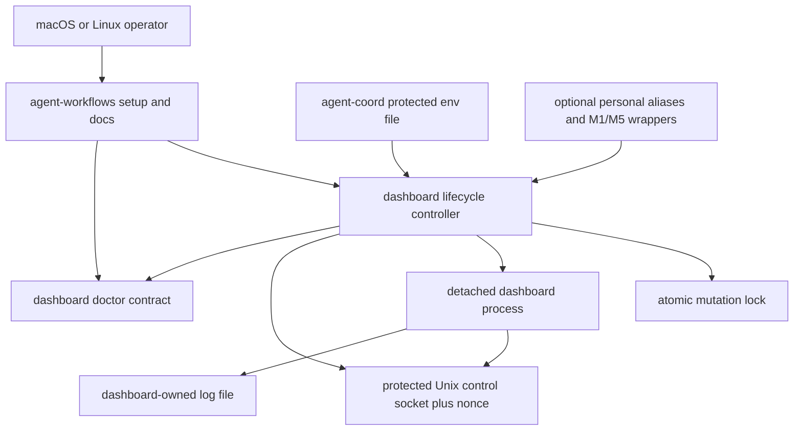
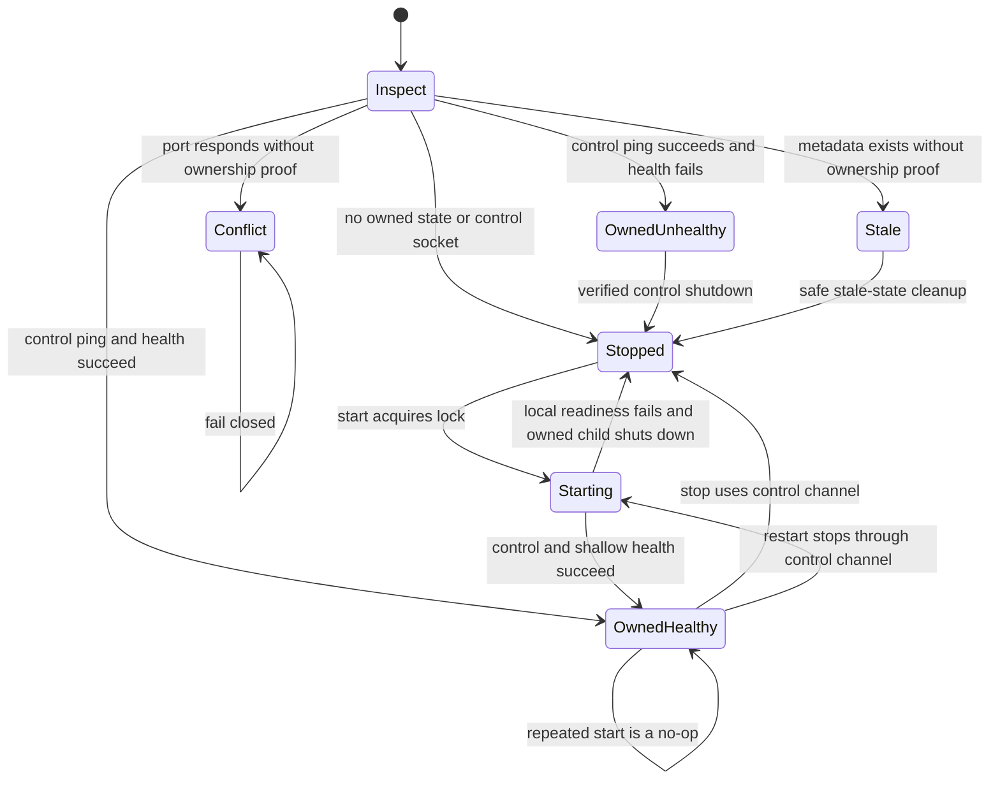

# Portable Dashboard Lifecycle - Plan

## Goal Capsule

- **Objective:** Give any macOS or Linux user a public, credential-safe way to install, start, stop, restart, inspect, and recover the agent coordination dashboard without private dotfiles or tmux.
- **Product authority:** The dashboard package owns dashboard lifecycle behavior; `agent-workflows` owns full-stack installation and contributor setup; consumer dotfiles remain optional conveniences.
- **Execution profile:** Cross-repository code, tests, setup documentation, and migration work across `agent-coordination-dashboard`, `agent-workflows`, `agent-coordination`, and `private-dotfiles`.
- **Stop conditions:** Stop rather than guess if the public environment-file contract changes upstream, ownership cannot be proven without signaling an arbitrary PID, or the doctor PRs invalidate the diagnostic seams below.
- **Tail ownership:** The executor owns dependency ordering, verification, PR publication, and the migration handoff until public lifecycle management replaces the private tmux implementation.

---

## Product Contract

### Summary

The public agent stack will provide a portable dashboard lifecycle command and a documented setup path for macOS and Linux. Every managed process launch, including start from stopped and the replacement created by restart, will load current private configuration instead of inheriting credentials from a persistent shell or terminal service; start against an owned healthy process remains a no-op.

### Problem Frame

The current dashboard lifecycle helper lives in a private dotfiles repository and uses tmux to keep the development server alive. Because the tmux server retains a global environment, restarting the dashboard can reuse a removed or rotated token even when the current shell and `agent-coord doctor --deep` use the new token.

The public full-stack setup already installs the workflow and coordination tools, prepares private runtime storage, and checks out the dashboard. It does not install a public dashboard lifecycle command, leaving contributors dependent on private shell configuration or manual foreground commands.

### Actors

- A1. **Operator:** Installs and runs the local agent stack on macOS or Linux.
- A2. **Dashboard lifecycle command:** Owns process startup, shutdown, health verification, logs, and configuration reload.
- A3. **Full-stack installer:** Installs public commands, prepares private runtime storage, and guides verification.

### Requirements

**Portable lifecycle**

- R1. The public dashboard package must provide start, stop, restart, status, logs, and open operations on supported macOS and Linux hosts.
- R2. The lifecycle command must not require tmux, a shell profile, or private dotfiles.
- R3. Repeated start, stop, and restart operations must be idempotent and must not terminate an unrelated process occupying the configured port.
- R4. The lifecycle command must retain a foreground server invocation for development, containers, and external process supervisors.
- R16. Lifecycle mutations must be serialized with an atomic directory lock, runtime files must be written atomically with restrictive permissions, and ambiguous stale locks or malformed state must fail closed until explicit recovery.
- R17. Stop and restart must prove ownership through a protected local control channel; a port or unverified PID is never sufficient authority to signal a process.
- R23. The control channel must require a secret per-start random nonce with at least 128 bits of entropy that matches protected mode-`0600` metadata so a substituted or stale socket cannot authorize shutdown.

**Configuration and credential safety**

- R5. Every managed process launch, including start from stopped and the replacement created by restart, must load current configuration from the public `agent-coord` mode-`0600` environment file selected by its documented default or explicit override; start against an owned healthy process must not reload it.
- R6. A removed API URL or token must clear the corresponding value for the new dashboard process rather than inherit an older value.
- R7. Tokens must not appear in process arguments, log output, issue text, committed files, or persistent launcher metadata.
- R8. Startup must fail safely when API mode is selected without the required token or when the owned dashboard cannot establish local control and shallow HTTP readiness.
- R18. Managed startup must reject missing, symlinked, non-regular, unreadable, or over-permissive environment files and must preserve logs while removing partial lifecycle state after failed validation.
- R21. Backend authentication or reachability failures discovered after local readiness must leave the dashboard available in degraded GitHub-only mode and surface nonzero deep diagnostics.
- R22. Managed environment files must accept only documented coordination and dashboard keys, reject duplicate or shell-executable syntax, and be validated and read through the same no-follow file descriptor.
- R24. Lifecycle logs must be created without following symlinks, remain mode `0600`, rotate within a documented bound, and redact credentials from diagnostics.

**Installation and diagnosis**

- R9. The full-stack setup must install or expose the dashboard lifecycle command alongside `agent-stack` and `agent-coord`.
- R10. Full-stack diagnostics must distinguish a stopped optional dashboard, an unhealthy dashboard process, and an unreachable coordination backend without duplicating component-owned health logic.
- R11. Setup and recovery documentation must cover installation, private configuration, first start, status, logs, deep diagnosis, token rotation, restart, and removal.
- R12. The documented recovery sequence must verify the CLI backend before restarting the dashboard and verify dashboard health afterward.
- R25. `agent-coordination` must own a machine-readable canonical environment-file discovery contract that dashboard and workflow installers consume.

**Migration and repository boundaries**

- R13. Public setup must not depend on `justin808/private-dotfiles` or any machine-specific alias, hostname, SSH topology, or secret store.
- R14. Personal dotfiles may retain aliases and cross-machine wrappers that call the installed public commands without reimplementing lifecycle behavior.
- R15. Existing authentication-recovery documentation must reference the public launcher rather than the private tmux workaround.
- R19. Public setup must standardize on the dashboard package's `4319` default and document migration from the private launcher's `4317` default without auto-stopping the old process.
- R20. Lifecycle locks, ownership metadata, control sockets, and logs must live in dashboard-owned local state rather than coordination data storage.

### Key Flows

- F1. **First-time setup**
  - **Trigger:** A1 installs the full agent stack on macOS or Linux.
  - **Actors:** A1, A3
  - **Steps:** Setup installs the public commands, creates protected runtime storage, directs A1 to configure the backend, and verifies the CLI before starting the dashboard.
  - **Outcome:** A1 can start and inspect the dashboard without private shell configuration.
  - **Covered by:** R1, R2, R5, R9, R11

- F2. **Normal restart**
  - **Trigger:** A1 updates the stack or requests a dashboard restart.
  - **Actors:** A1, A2
  - **Steps:** The lifecycle command stops only its owned process, reloads current private configuration, starts a replacement, and verifies health.
  - **Outcome:** The running dashboard reflects the current configuration and reports a usable status.
  - **Covered by:** R3, R5, R6, R8, R12

- F3. **Credential rotation recovery**
  - **Trigger:** The coordination backend rejects a removed or rotated machine token.
  - **Actors:** A1, A2, A3
  - **Steps:** A1 updates the protected environment file, verifies the new token with deep CLI diagnostics, restarts the dashboard, and runs stack or dashboard diagnostics.
  - **Outcome:** Both the CLI and dashboard authenticate with the same current identity and scopes.
  - **Covered by:** R5, R6, R7, R8, R10, R12

- F4. **Private-dotfiles migration**
  - **Trigger:** The public lifecycle command becomes available.
  - **Actors:** A1, A2
  - **Steps:** A1 replaces the private launcher with optional aliases that invoke the public command and removes the tmux-specific workaround.
  - **Outcome:** Personal configuration contains no duplicate lifecycle implementation.
  - **Covered by:** R13, R14, R15

### Acceptance Examples

- AE1. **Fresh public install**
  - **Covers:** R1, R2, R9, R11
  - **Given:** A supported host with no private dotfiles and no tmux installation
  - **When:** The operator follows the public full-stack setup and starts the dashboard
  - **Then:** The dashboard runs in the background, status succeeds, and logs are available through the public command

- AE2. **Rotated token**
  - **Covers:** R5, R6, R7, R8, R12
  - **Given:** A running dashboard authenticated with an old token and a protected environment file containing its replacement
  - **When:** The operator verifies the replacement and restarts the dashboard
  - **Then:** The replacement process uses the new token, the old value is not inherited, and no token appears in command lines or logs

- AE3. **API mode disabled**
  - **Covers:** R4, R6, R8
  - **Given:** A previous process used the HTTP coordination backend
  - **When:** The operator removes the API configuration and restarts
  - **Then:** The new process uses filesystem mode and does not retain the previous API URL or token

- AE4. **Unrelated port listener**
  - **Covers:** R3
  - **Given:** Another process occupies the configured dashboard port
  - **When:** The operator runs start, restart, or stop
  - **Then:** The lifecycle command reports the ownership conflict without killing the unrelated process

- AE5. **Concurrent lifecycle requests**
  - **Covers:** R3, R16, R17
  - **Given:** Two operators or scripts request start or restart at the same time
  - **When:** Both lifecycle mutations reach the same runtime directory
  - **Then:** One mutation owns the lock, the other exits predictably, and only one owned dashboard remains

- AE6. **Failed managed startup**
  - **Covers:** R7, R8, R16, R18
  - **Given:** The selected environment file is unsafe or the owned dashboard cannot establish local control and shallow HTTP readiness
  - **When:** The operator starts or restarts the dashboard
  - **Then:** Startup fails without exposing credentials, no unverified process is killed, partial ownership state is removed, and logs remain available

- AE7. **Already-running start after configuration change**
  - **Covers:** R3, R5, R6
  - **Given:** An owned healthy dashboard is already running and the environment file has changed
  - **When:** The operator runs start
  - **Then:** Start reports that the existing process was not reloaded and directs the operator to restart

- AE8. **Private launcher migration**
  - **Covers:** R13, R14, R15, R19
  - **Given:** The tmux-based private launcher still owns a dashboard on port `4317`
  - **When:** The operator installs the public lifecycle command
  - **Then:** Setup identifies the old listener as unowned, documents its explicit shutdown, and starts the public dashboard on `4319` only after the conflict is resolved

- AE9. **Backend authentication degradation**
  - **Covers:** R8, R10, R21
  - **Given:** An owned dashboard has local control and shallow HTTP health but the coordination backend returns `401`
  - **When:** Managed startup or deep diagnosis checks coordination resources
  - **Then:** The dashboard remains available with GitHub-only data, deep diagnostics return nonzero with recovery guidance, and no credential appears in output

- AE10. **Hostile local lifecycle artifacts**
  - **Covers:** R16, R18, R22, R23, R24
  - **Given:** A local path is replaced after inspection, a fake control socket responds, or a log path is a symlink
  - **When:** A lifecycle mutation validates and uses those artifacts
  - **Then:** The command rejects the artifact or requires explicit recovery without signaling a process, overwriting a target, or exposing a secret

- AE11. **Ambiguous stale lock**
  - **Covers:** R16
  - **Given:** A lifecycle lock remains but no owned control channel can prove whether a mutation is active
  - **When:** The operator runs start, stop, or restart
  - **Then:** The command does not reclaim the lock automatically and directs the operator to explicit recovery that first proves no managed instance is reachable

### Success Criteria

- A new macOS or Linux operator can install and manage the dashboard using only public repositories and documented commands.
- Token rotation recovery leaves both deep CLI diagnostics and dashboard diagnostics healthy without restarting a terminal multiplexer.
- The private dotfiles launcher can be removed without losing dashboard lifecycle functionality.
- Existing stack diagnostics consume component-owned contracts and remain secret-safe.

### Scope Boundaries

- Automatic startup through launchd, systemd, or desktop login items is deferred.
- Windows-native lifecycle support is deferred.
- Hosted dashboard deployment and remote multi-user operations are outside this local lifecycle feature.
- Personal cross-machine synchronization, SSH aliases, and secret-store preferences remain outside public stack behavior.

### Dependencies and Assumptions

- The dashboard package remains the public owner of its executable and health contract.
- The full-stack setup remains distinct from the generic consumer-repository skill installer, even as it becomes usable by any agent-stack contributor.
- Open stack-doctor work in `agent-workflows` and the dashboard should be reused rather than copied into the lifecycle command.
- Public lifecycle work should supersede the tmux-specific private-dotfiles workaround and update the authentication-recovery documentation that currently depends on it.

### Sources and Research

- `bin/agent-stack` and `docs/installation-and-upgrades.md` define the current full-stack setup and protected runtime root.
- The dashboard package manifest and README define the executable and runtime configuration contract.
- [agent-workflows issue #159](https://github.com/shakacode/agent-workflows/issues/159) tracks public installation and rollout; [agent-coordination-dashboard issue #63](https://github.com/shakacode/agent-coordination-dashboard/issues/63) tracks the dashboard-owned lifecycle command.
- [agent-workflows PR #152](https://github.com/shakacode/agent-workflows/pull/152) and [agent-coordination-dashboard PR #59](https://github.com/shakacode/agent-coordination-dashboard/pull/59) define the active component-owned doctor direction.
- [agent-workflows PR #156](https://github.com/shakacode/agent-workflows/pull/156) documents authentication recovery but currently depends on [private-dotfiles PR #36](https://github.com/justin808/private-dotfiles/pull/36).
- [Node.js child process documentation](https://nodejs.org/docs/latest-v22.x/api/child_process.html#optionsdetached) defines detached-process, `unref`, and redirected-stdio behavior used by the launcher.
- [Node.js `util.parseEnv` documentation](https://nodejs.org/docs/latest-v22.x/api/util.html#utilparseenvcontent) supplies data-only dotenv parsing at the package's supported Node floor; the plan adds an allowlist because parsing does not make arbitrary environment keys safe.

---

## Planning Contract

The Product Contract above is preserved from the confirmed brainstorm scope. The decisions below resolve implementation shape without widening the product to login services, Windows support, hosted operation, or private-machine policy.

### Key Technical Decisions

- KTD1. **Keep lifecycle ownership in the dashboard package.** The package already owns the executable, server configuration, health endpoint, and public npm contents. `agent-workflows` installs and invokes this interface instead of encoding Node process details.
- KTD2. **Use a protected Unix-domain control channel plus nonce as ownership proof.** A server-bootstrap lifecycle module owns the TCP listener and protected socket, answers only authenticated ping and shutdown, closes TCP gracefully, and removes the socket. PID, port, and health metadata remain diagnostic evidence, but none authorizes termination.
- KTD3. **Model lifecycle state explicitly and fail closed.** The command distinguishes stopped, owned healthy, owned unhealthy, stale state, locked mutation, and unowned port conflict. Mutations acquire an atomic directory lock, never auto-reclaim an ambiguous stale lock, and expose explicit recovery only after proving no managed control channel is reachable.
- KTD4. **Use the public coordination environment file as the single managed configuration authority.** `agent-coordination` resolves the `AGENT_COORD_ENV_FILE` override or canonical default through a machine-readable contract. Managed starts open the file without following symlinks, validate and read the same descriptor, accept only allowlisted keys, clear current and legacy coordination variables, then apply file values including empty strings.
- KTD5. **Keep foreground behavior additive and unchanged.** No-argument and existing server options continue to run in the foreground. Lifecycle subcommands enter a separate controller so development, containers, and external supervisors retain the existing contract.
- KTD6. **Separate process status from component and stack diagnosis.** Lifecycle `status` classifies ownership and shallow health. Dashboard `doctor --stack-json` owns component and backend evidence. `agent-stack doctor` aggregates those contracts without recreating their probes.
- KTD7. **Build on the active public seams.** Dashboard lifecycle work layers on the component-doctor branch from PR #59. Stack installation layers on the modular installer branch from PR #152. Authentication-recovery PR #156 is then revised to point at the public command, and private PR #36 is reduced to personal wrappers or superseded.
- KTD8. **Use explicit startup in v1.** Detached processes, logs, and lifecycle commands are portable across supported macOS and Linux hosts. launchd and systemd units remain follow-up work because they add platform policy rather than lifecycle capability.
- KTD9. **Keep locally healthy dashboards running through backend degradation.** Startup readiness requires the owned control channel and shallow HTTP health. Deep backend diagnostics run afterward; authentication or reachability failure returns degraded/nonzero evidence while preserving the dashboard's GitHub-only surface.

### High-Level Technical Design

The diagram shows ownership and delegation. It is a boundary map, not a prescribed module graph.

The lifecycle state machine makes unsafe ambiguity terminal rather than destructive.

### Lifecycle and Configuration Contracts

- The dashboard runtime directory is package-owned local state and contains only the lock, control socket, protected metadata including the secret nonce, and logs. Coordination claims, heartbeats, batches, and events remain under `AGENT_COORD_STATE_ROOT`.
- The runtime root resolves from `AGENT_COORD_DASHBOARD_RUNTIME_DIR` or the XDG state home, falling back to `~/.local/state/agents-coordination-dashboard/lifecycle`. The same dashboard-owned resolver is used by commands, diagnostics, documentation, and tests.
- Metadata records the supervisor PID, base URL, and start time for observability. It also stores the secret instance nonce with mode `0600`; status, doctor, logs, and captured tests must never emit it. Control requests must present the matching nonce before the server-bootstrap lifecycle module answers ping or graceful shutdown.
- Managed starts open protected files without following symlinks, validate ownership/type/mode from that descriptor, read from the same descriptor, reject unknown or duplicate keys and shell syntax, and never persist the resulting environment.
- Startup waits for the exact owned instance to establish control and shallow health. Local readiness failure requests owned shutdown and removes partial state. Deep backend failure leaves the dashboard running in degraded GitHub-only mode and preserves recovery evidence.
- Stop never escalates to signaling an unverified PID. If the control channel cannot prove ownership, the command reports stale state or conflict with recovery guidance.
- The detached process is the existing foreground supervisor; the server-bootstrap lifecycle module owns the TCP listener, control socket, graceful close, and socket cleanup. The supervisor exits naturally after its server child.
- Lock release is limited to the controller that acquired the atomic directory. Ambiguous stale locks are not reclaimed during normal commands and require explicit recovery.
- `logs` creates no-follow mode-`0600` files, rotates them within a documented bound, and reports a clear empty state before first launch. `open` selects the platform opener through an injectable adapter.

### Threat Model

- In scope: accidental concurrent commands, stale state, unrelated listeners, hostile paths owned by another user, and local processes that cannot read the mode-protected runtime directory.
- Out of scope: a malicious or compromised process running as the same OS user. That actor can inspect the user's memory and protected files, so the lifecycle command must not claim same-user isolation it cannot provide.
- The nonce prevents accidental or different-user socket substitution within the OS permission boundary; it is lifecycle authentication material, not public instance metadata.

### Sequencing

1. Extend `agent-coordination` with the canonical machine-readable environment-file discovery contract.
2. Land or stack on the dashboard component-doctor contract, then add dashboard-owned lifecycle behavior.
3. Extend the modular `agent-stack` installer to consume the coordination contract, install the exact checked-out dashboard revision with its committed lockfile, and expose the package executable.
4. Revise public recovery and rotation documentation to use the installed lifecycle command and canonical port.
5. Replace the private launcher implementation with aliases and cross-machine wrappers after the public command is verified on macOS and Linux.

### System-Wide Impact

- **Authentication:** Managed child processes no longer trust persistent shell or tmux environments for coordination credentials. Only allowlisted keys from a same-descriptor validated file are applied after current and legacy token variables are cleared.
- **Process lifecycle:** A nonce-bound dashboard-owned Unix control socket becomes the only stop authority for managed instances. The foreground supervisor remains the detached process boundary.
- **Diagnostics:** Stack health gains clearer separation between optional dashboard stopped, managed process unhealthy, and backend authentication or reachability failures.
- **Installation:** Full-stack sync changes from cloning the dashboard source only to installing its locked dependencies, running package-owned validation/build steps, and exposing its public executable.
- **Compatibility:** Foreground invocation remains unchanged. Existing private listeners are unowned and require explicit operator shutdown during migration.
- **Documentation:** Setup, upgrades, token rotation, and private-dotfiles guidance converge on one command and one environment-file contract.

### Risks and Dependencies

| Risk or dependency | Consequence | Mitigation |
|---|---|---|
| PR #59 and lifecycle both modify the dashboard CLI | Merge conflict or duplicated doctor parsing | Stack lifecycle work on PR #59 and keep lifecycle helpers outside the growing entrypoint |
| PR #152 changes `agent-stack` installer structure | Integration work targets obsolete seams | Base workflow integration on PR #152 and extend its installer and runtime modules |
| Unsafe or stale runtime files | Arbitrary process termination or credential exposure | Enforce directory and file modes, reject symlinks, serialize mutations, and require control-channel proof |
| File replacement after validation | Symlink clobbering or stale-owner confusion | Validate and read the same descriptor, use nonce-bound control, and reject unexpected path identities |
| Arbitrary env keys such as `NODE_OPTIONS` or `PATH` | Code execution in the managed child | Allowlist coordination/dashboard keys and reject duplicate, unknown, or shell-style entries |
| Linux and macOS opener/process differences | One supported platform works only accidentally | Inject platform actions in tests and collect one macOS and one Linux smoke result |
| Recovery docs drift across PRs and repos | Operators repeat the stale-token incident | Make the coordination runbook canonical, link to it from PR #156, then supersede the private workaround |
| Component diagnostics drift | Stack doctor reports misleading health | Consume the versioned component contract and keep lifecycle status shallow |
| Compromised same-user process | Runtime files and process memory can be inspected or replaced | State this OS-boundary limitation explicitly and avoid claiming same-user isolation |

### Documentation and Operational Notes

- Document the default environment file, `AGENT_COORD_ENV_FILE` override, `AGENT_COORD_DASHBOARD_RUNTIME_DIR`, XDG fallback, mode requirements, log path, and foreground escape hatch.
- Document first install, already-running start, restart after config change, token rotation, API disablement, stale state, unowned port conflicts, and old `4317` launcher migration.
- Preserve bounded, rotated logs on failed startup and name the exact component and stack diagnostic commands in recovery guidance.
- Mark launchd, systemd, Windows-native lifecycle, and remote multi-user process control as deferred rather than partially supporting them.

---

## Implementation Units

### U1. Add dashboard lifecycle state and ownership primitives

- **Repository:** `agent-coordination-dashboard`
- **Goal:** Create the secure local state, locking, configuration, control-channel, and ownership primitives used by every lifecycle operation.
- **Requirements:** R3, R5-R7, R16-R18, R20, R22-R25; F2, F3; AE2-AE6, AE10
- **Files:** `bin/lifecycle/runtime.js`, `bin/lifecycle/environment.js`, `bin/lifecycle/control.js`, `src/server/lifecycleControl.ts`, `src/server/index.ts`, `scripts/cli.test.ts`, `src/server/lifecycleControl.test.ts`
- **Approach:** Add mode-protected package state, an atomic directory lock with explicit stale-lock recovery, descriptor-safe allowlisted env parsing, atomic metadata, and a server-bootstrap Unix control socket bound to a secret per-start nonce. Keep Express health semantics unchanged unless instance evidence proves necessary.
- **Test scenarios:** Reject unsafe and swapped environment/runtime/log paths; preserve empty-value clearing; reject hostile `NODE_OPTIONS`, `PATH`, duplicate keys, and shell syntax; serialize concurrent mutations; refuse ambiguous stale-lock reclamation; classify stale metadata; reject a responsive fake socket or reused PID; verify owned graceful shutdown.
- **Verification:** Focused lifecycle and server tests show each state transition and no captured output or runtime file contains sentinel credentials.
- **Dependencies:** U6 and dashboard PR #59.

### U2. Add portable lifecycle commands to the dashboard executable

- **Repository:** `agent-coordination-dashboard`
- **Goal:** Provide start, stop, restart, status, logs, and open while preserving the existing foreground server and doctor contracts.
- **Requirements:** R1-R4, R8, R16-R18, R21, R23, R24; F1-F3; AE1-AE7, AE9, AE10
- **Files:** `bin/agent-coordination-dashboard.js`, `bin/lifecycle/commands.js`, `scripts/cli.test.ts`, `scripts/package.test.ts`, `package.json`, `README.md`
- **Approach:** Route lifecycle subcommands before legacy server parsing, detach the existing foreground supervisor with protected rotating log descriptors, wait for nonce-bound ownership and shallow health, then delegate deep evidence to the component doctor. Keep `start` idempotent without silently reloading changed configuration.
- **Test scenarios:** Exercise every command, repeated operations, local startup and shutdown timeouts, deep-backend degradation that leaves the dashboard running, missing and rotated logs, hostile log symlinks, platform opener selection, and preservation of no-argument foreground behavior.
- **Verification:** The packaged executable manages a background dashboard without tmux, rejects unowned conflicts, and retains doctor exit and output compatibility.
- **Dependencies:** U1.

### U4. Integrate dashboard installation into the public full stack

- **Repository:** `agent-workflows`
- **Goal:** Make `agent-stack sync` install the dashboard command and prepare the shared public environment-file contract.
- **Requirements:** R5, R9, R10, R13, R20, R25; F1; AE1
- **Files:** `bin/agent_stack/installers.bash`, `bin/agent_stack/runtime.bash`, `bin/agent_stack/sync.bash`, `bin/agent_stack/usage.bash`, `test/agent_stack/install_test.bash`, `test/agent_stack/support.bash`
- **Approach:** Extend PR #152's modular installer to consume `agent-coordination` environment-file discovery, remove the parallel `~/.agent-workflows/env` authority, run `npm ci --ignore-scripts` against the exact checked-out dashboard commit and committed lockfile, run the package-owned build explicitly, then expose its declared executable. Validate every managed-root and bin-directory component as same-user-owned and non-symlink, create the command without clobbering unexpected targets, and revalidate identities before activation.
- **Test scenarios:** Fresh and repeated sync, custom `AGENT_COORD_ENV_FILE`, exact revision and lockfile use, dependency-integrity failure, unsafe or swapped install paths, hostile symlinks, wrong ownership, over-permissive directories, dashboard build failure, and optional dashboard stopped versus unhealthy diagnostic states.
- **Verification:** Focused stack tests prove installation from the selected checkout, path convergence, permissions, hostile-path rejection, and component-doctor delegation.
- **Dependencies:** U2, U6, and agent-workflows PR #152.

### U5. Rewrite public setup and recovery documentation

- **Repository:** `agent-workflows`
- **Goal:** Give any macOS or Linux user a complete setup path and route stale-token recovery to one canonical public runbook.
- **Requirements:** R10-R15, R19; F1-F4; AE1, AE2, AE3, AE7, AE8
- **Files:** `README.md`, `docs/installation-and-upgrades.md`, `docs/agent-coordination.md`
- **Approach:** Revise PR #156 to replace current-shell and private `agent-dashboard` instructions with the installed lifecycle command and one environment file. Keep installation-specific context here and link token rotation, CLI-first verification, dashboard restart, and post-restart diagnosis to U9's canonical runbook.
- **Test scenarios:** Documentation walkthrough covers a clean host, the canonical recovery link, already-running start, logs, unowned `4317` listener, and removal.
- **Verification:** Every documented command exists after U4, no private repository is required, and secret examples use placeholders only.
- **Dependencies:** U4 and agent-workflows PR #156.

### U6. Publish the coordination environment-file discovery contract

- **Repository:** `agent-coordination`
- **Goal:** Give every consumer one machine-readable environment-file discovery rule before dashboard and workflow integration.
- **Requirements:** R5, R11, R13, R25; F1, F3; AE1-AE3
- **Files:** `bin/agent-coord`, `test/agent_coordination_cli_test.rb`, `README.md`
- **Approach:** Expose the `AGENT_COORD_ENV_FILE` override and canonical XDG/home default through a stable machine-readable CLI contract.
- **Test scenarios:** Override, XDG default, HOME default, missing HOME, and stable machine-readable output.
- **Verification:** Focused CLI tests prove discovery semantics without loading or displaying credentials.
- **Dependencies:** None.

### U9. Make the coordination runbook the recovery authority

- **Repository:** `agent-coordination`
- **Goal:** Provide one canonical token-rotation and stale-authentication recovery procedure that other setup docs link to instead of copying.
- **Requirements:** R5-R8, R10-R15, R21, R22; F3, F4; AE2, AE3, AE9
- **Files:** `docs/runbooks/rotate-backend.md`, `README.md`
- **Approach:** Replace private launcher references with the public dashboard command, retain the rule that scopes come from the recorded machine identity rather than the resource that returned `401`, and make `agent-workflows` docs link here for recovery details.
- **Test scenarios:** URL/token replacement, legacy-token removal, CLI deep verification, degraded dashboard restart, post-restart diagnostics, and rollback guidance.
- **Verification:** The runbook has no private command dependency, contains the complete recovery sequence once, and agrees with dashboard behavior.
- **Dependencies:** U2 and U5.

### U7. Reduce private dotfiles to personal wrappers

- **Repository:** `private-dotfiles`
- **Goal:** Remove duplicate process and credential handoff logic while preserving Justin's aliases and M1/M5 convenience.
- **Requirements:** R13-R15, R19; F4; AE8
- **Files:** `bin/agent-dashboard`, `home/.zshrc`, `README.md`
- **Approach:** Replace the tmux/FIFO/nohup lifecycle implementation from PR #36 with a thin delegation to the installed public command. Keep personal remote-machine and browser preferences only when they do not alter lifecycle semantics.
- **Test scenarios:** Wrapper forwards lifecycle operations and overrides, does not read or hand off token values, and reports a useful install error when the public command is absent.
- **Verification:** No tmux session, FIFO, token transport, or duplicate PID/log behavior remains in the private implementation.
- **Dependencies:** U2, U4, and U9.

### U8. Verify cross-repository migration and publish the rollout

- **Repositories:** `agent-coordination-dashboard`, `agent-workflows`, `agent-coordination`, `private-dotfiles`
- **Goal:** Prove the public path end to end and publish dependency-aware PRs that supersede the private workaround.
- **Requirements:** R1-R25; F1-F4; AE1-AE11
- **Files:** No feature files beyond fixes revealed by verification; PR descriptions and linked issue/PR metadata carry rollout order.
- **Approach:** Test on Linux CI and a macOS host, validate token replacement and API disablement with sentinel values, verify an unrelated listener survives, then link dashboard issue #63 and workflow issue #159 from the PRs. Mark private PR #36 superseded after the public PRs are reviewable.
- **Test scenarios:** Fresh install, normal restart, rotated token, filesystem fallback, concurrent start, swapped local artifacts, backend degradation, old launcher migration, and removal.
- **Verification:** All repository gates pass, manual evidence covers both supported operating systems, and each PR states its base dependency and safe landing order.
- **Dependencies:** U1, U2, U4-U7, and U9.

---

## Verification Contract

| Repository | Gate | Command or evidence | Done signal |
|---|---|---|---|
| `agent-coordination-dashboard` | Focused lifecycle tests | `npm test -- scripts/cli.test.ts scripts/package.test.ts src/server/lifecycleControl.test.ts` | Lifecycle, config, ownership, packaging, and server cases pass |
| `agent-coordination-dashboard` | Full package gates | `npm test`, `npm run typecheck`, `npm run build` | Test suite, TypeScript, and production build pass |
| `agent-workflows` | Focused stack tests | `bin/agent-stack-test.bash test/agent_stack/install_test.bash` or the focused selector exposed by PR #152 | Installer, runtime path, permissions, and doctor delegation cases pass |
| `agent-workflows` | Repository validation | `bin/validate` | Source-pack validation passes after focused tests |
| `agent-coordination` | Environment discovery tests | `ruby -Itest test/agent_coordination_cli_test.rb` | Override/default/missing-home behavior and stable machine-readable output pass |
| `agent-coordination` | Repository validation | `.agents/bin/validate` | CLI, runbook, packaging, and style gates pass |
| `private-dotfiles` | Wrapper smoke test | Invoke wrapper help/status with a stub public executable and with the executable absent | Delegation and missing-install guidance pass without reading credentials |
| Cross-repository | Linux lifecycle evidence | Ubuntu CI or equivalent Linux fixture runs fresh install through removal | No tmux dependency; ownership and recovery acceptance examples pass |
| Cross-repository | macOS lifecycle evidence | Local macOS smoke run with sentinel credentials and a disposable state root | Detached start, open adapter, restart, logs, and stop behave as documented |
| Cross-repository | Local-artifact adversarial audit | Substitute env/log/socket paths after inspection and answer from a fake control socket | Same-descriptor validation and nonce binding reject every substitution |
| Cross-repository | Secret-safety audit | Search changed files, process arguments, logs, metadata, rotated logs, and captured test output for sentinel values | No token or sentinel secret appears outside the protected env fixture |

Behavioral verification must prove the failure paths, not only command availability: concurrent mutations serialize, replaced artifacts fail closed, unsafe environment files fail before spawn, local-readiness failures roll back owned state, backend failures preserve degraded GitHub-only service, changed configuration requires restart, and unowned listeners are never stopped.

---

## Definition of Done

- The dashboard package publishes lifecycle commands that satisfy U1-U2 while preserving foreground and doctor compatibility.
- `agent-coordination` publishes the canonical machine-readable environment-file discovery contract.
- `agent-stack sync` consumes that contract, installs the public dashboard command, and removes the duplicate private environment-file authority.
- Workflow and coordination docs describe one install, recovery, restart, and diagnosis path for macOS and Linux.
- Private dotfiles contain only aliases or personal cross-machine wrappers and no longer implement tmux, FIFO, credential handoff, detachment, ownership, or logs.
- Every acceptance example has automated coverage where portable and explicit macOS/Linux smoke evidence where platform behavior differs, including fake-socket, path-swap, lock-race, log-rotation, and degraded-backend cases.
- All gates in the Verification Contract pass with sentinel secret scans clean.
- Dashboard issue #63 and workflow issue #159 are linked from the implementation PRs; PR #156 is updated to the public recovery flow; private PR #36 is superseded or reduced to wrappers.
- Abandoned lifecycle approaches, duplicate environment files, stale test fixtures, and dead-end compatibility code are removed from every final diff.
